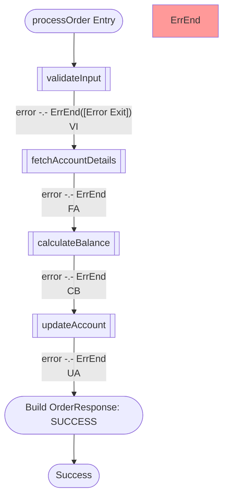
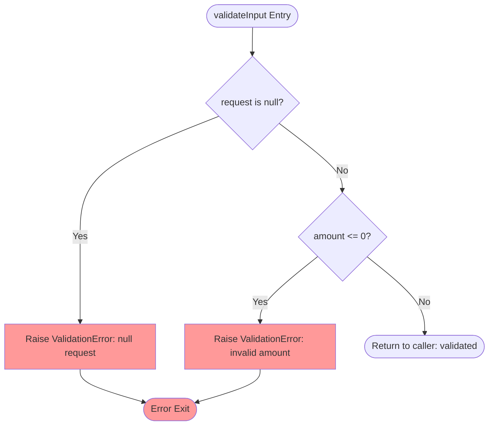
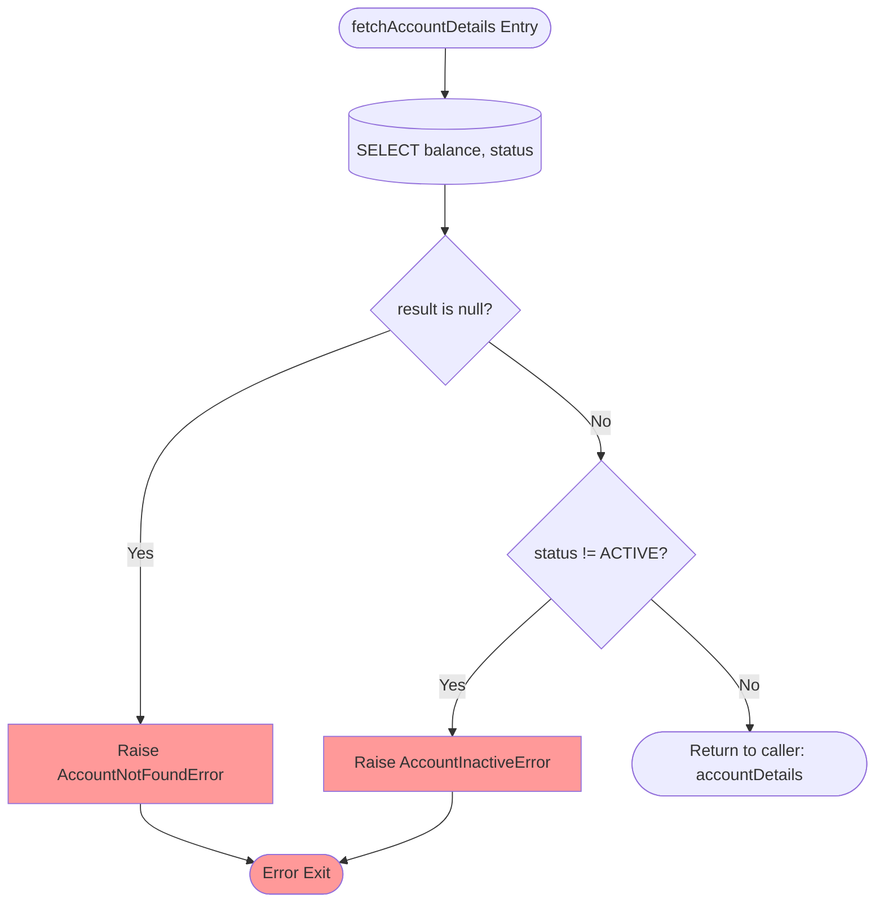
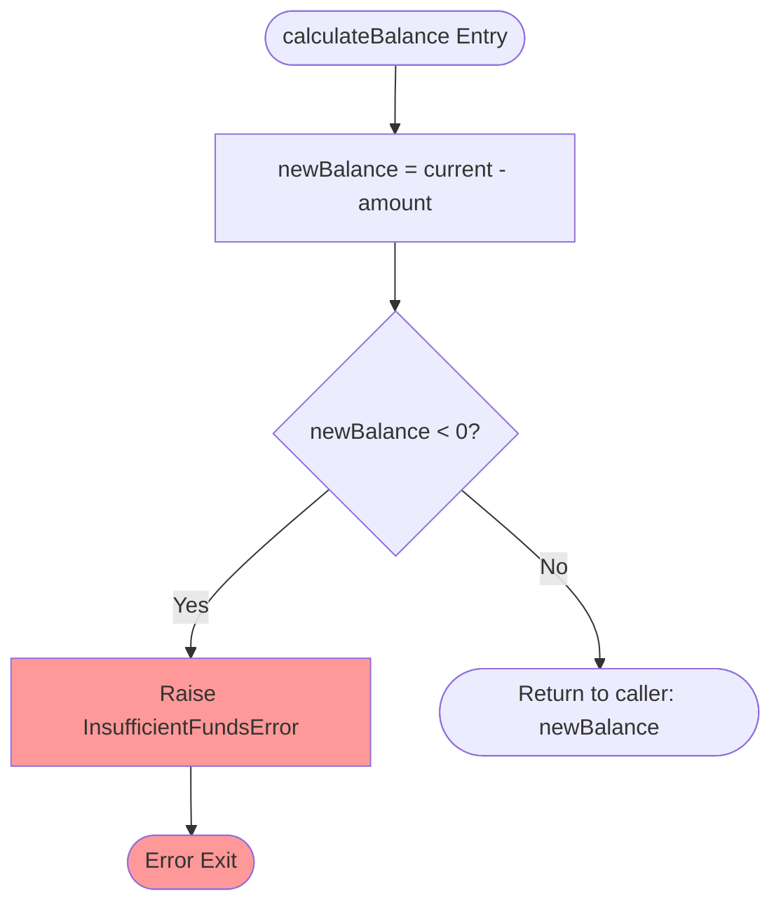
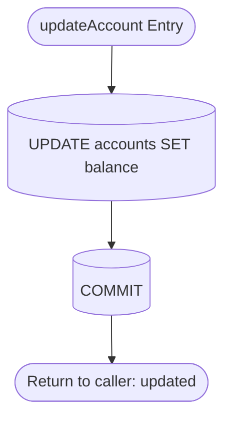

# Analysis Activity Diagram Skill

Generates modular Mermaid flowcharts - one orchestration diagram + one detail flowchart per callable unit with internal logic. Each diagram is self-contained with a heading and description.

## Output

`./output/code-analysis/analysis-activity-diagram.md`

## Modular Strategy

### Diagram Types

1. **Orchestration**:

- Callable units as [[subroutine]] nodes in execution order.
- No internals.
- Error paths as dashed lines to `([Error Exit])`.

2. **Detail**:

- One standalone `flowchart TD` per callable unit with internal logic.

### When to Split

Detail diagram when: 3+ steps, conditionals, DB ops, error paths, or loops.
Fold into orchestration when: trivial pass-through, getter/setter, or 1-2 straight-line steps.

### Cross-References

- Orchestration: annotate nodes with detail diagram references.
- Detail happy path: `([Return to caller])`
- Detail error path: `([Error Exit])`

## Syntax

### Elements

| Element    | Syntax             | Use for                   |
| :--------- | :----------------- | :------------------------ |
| Start/End  | A([Label])         | Entry and exit points     |
| Process    | A[Action]          | Execution steps           |
| Decision   | A{Condition?}      | if/else, switch           |
| Database   | A[(SQL Operation)] | Queries, updates, commits |
| Subroutine | A[[Function Call]] | Calls to other units      |
| Flow       | A --> B            | Sequential connection     |
| Labeled    | A -- label --> B   | Conditional branch        |
| Dashed     | A -.- B            | Error/alternate path      |
| Style      | style A fill:#f99  | Highlight error nodes     |

### Conventions

- Error nodes: always `fill:#f99`
- Database nodes: `[(description)]` cylinder shape
- Each detail diagram is standalone `flowchart TD`
- Max 15-20 nodes per diagram
- Each diagram: heading + description + fenced mermaid block

## Objectives

### Objectives 1 — Map and Classify Callable Units

- Identify all callable units, steps, decisions, DB ops.
- Identify entrypoint.
- Classify: detail diagram vs fold into orchestration.

### Objectives 2 — Generate Orchestration Diagram

- Heading: ## Orchestration: [RootFunction]
- 1-2 sentence description.
- Each callable unit as `[[subroutine]]` node in execution order.
- Dashed lines for error paths to `([Error Exit])`.
- End with `([Success])` terminal.

### Objectives 3 — Generate Detail Diagrams

- Per qualifying callable unit:
  - Heading: ## Detail: [FunctionName]
  - 1-2 sentence description.
  - Entry: `([FunctionName Entry])`
  - Map all steps, decisions (both branches labeled), DB ops, loops (back-edges), errors (`fill:#f99`).
  - Happy path: `([Return to caller])` / Error path: `([Error Exit])`.
- Split further if node count exceeds 15-20.

### Objectives 4 — Validate Completeness and Syntax

- [ ] Orchestration diagram with all calls in order.
- [ ] Detail diagram for every callable unit with internal logic.
- [ ] Every source step appears in at least one diagram.
- [ ] Every conditional has both branches labeled.
- [ ] Every loop has back-edge and exit.
- [ ] All DB ops as database nodes, all errors styled.
- [ ] No dead-end nodes — every path reaches a terminal.
- [ ] Each diagram has heading + description.
- [ ] Syntactically correct Mermaid throughout.

## Example

````markdown
## Metadata

Source:
Date:
Description:

## Orchestration: ProcessOrder

High-level order processing flow. Detail diagrams below.



## Detail: validateInput

Validates request for null and invalid amounts.



## Detail: fetchAccountDetails

Queries DB for account balance/status. Errors if missing or inactive.



## Detail: calculateBalance

Computes new balance. Raises InsufficientFundsError if negative.



## Detail: updateAccount

Persists new balance and commits transaction.


````

## Rules

- **MUST** produce orchestration + detail diagrams (never one monolithic diagram).
- Max 15-20 nodes per diagram.
- **MUST** include heading and description for every diagram.
- **MUST** cover every step, conditional (both branches), loop (back-edge + exit), DB op, and error path.
- **MUST** style error nodes with `fill:#f99` and terminate all paths - no dead ends.
- **MUST** produce syntactically correct Mermaid.
- **MUST NOT** omit any callable unit, step, or path.
- **MUST NOT** create detail diagrams for trivial pass-through callable units.
