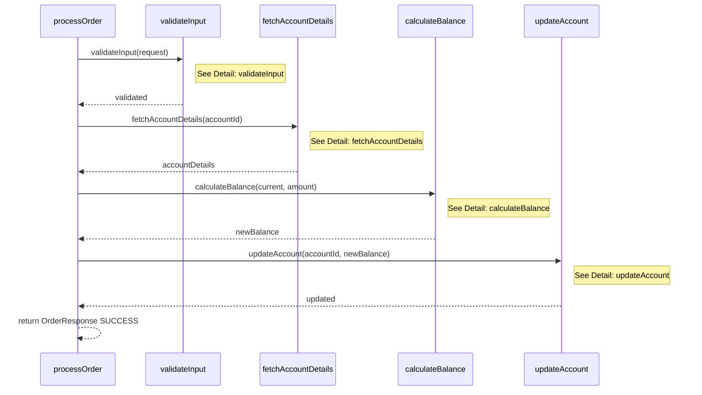
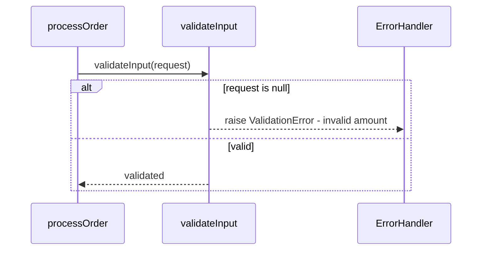
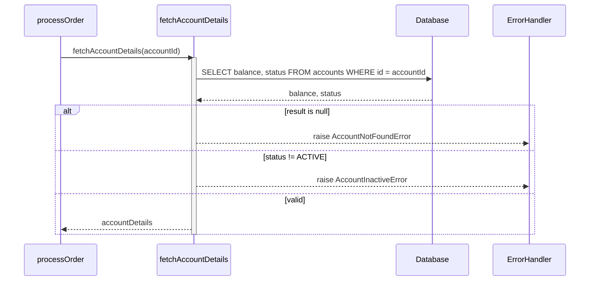
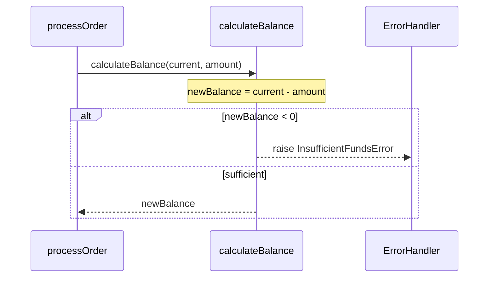
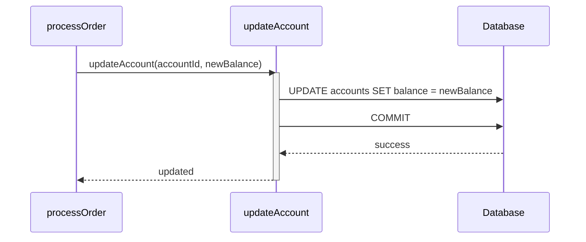

# Analysis Sequence Diagram Skill

Generates modular Mermaid sequence diagrams — one overview + one detail diagram per callable unit with internal logic. Each diagram is self-contained with a heading and description.

## Output

`./output/code-analysis/analysis-sequence-diagram.md` — Single Markdown file with multiple mermaid diagrams

## Modular Strategy

### Diagram Types

1. **Overview**: Entrypoint + direct callees. Top-level call/return only. References detail diagrams via `Note`.
2. **Detail**: One per callable unit with internal logic. Full interactions within that unit's scope.

### When to Split

Detail diagram when: 3+ steps, conditionals, DB ops, error paths, or nested calls.
Fold into caller when: trivial pass-through, getter/setter, or 1-2 straight-line steps.

## Syntax

### Elements

| Element    | Syntax                                  | Use for                                                                   |
| :--------- | :-------------------------------------- | :------------------------------------------------------------------------ |
| Participant | `participant A as Name`                | Declare callable unit                                                     |
| Sync call  | `A->>B: message`                        | Call                                                                      |
| Return     | `B-->>A: result`                        | Return value                                                              |
| Conditional | `alt cond` / `else other` / `end`      | if/else branches                                                          |
| Optional   | `opt cond` / `end`                      | if-only (no else)                                                         |
| Loop       | `loop desc` / `end`                     | Iteration                                                                 |
| Note       | `Note over A,B: text`                   | Annotations                                                               |
| Activation | `activate A` / `deactivate A`           | Active lifeline                                                           |
| Database   | `participant DB as Database`            | Error handler: `participant EH as ErrorHandler` (when centralized)        |

### Conventions

- Max 5-7 participants per diagram.
- Each diagram: heading + description + fenced mermaid block.

## Objectives

### Objectives 1 — Map and Classify Callable Units

List all callable units with call relationships. Identify entrypoint. Classify: Detail diagram vs fold into parent.

### Objectives 2 — Generate Overview Diagram

- Heading: ## Overview: [RootFunction] Orchestration
- 1-2 sentence description.
- Entrypoint + direct callees as participants.
- Top-level call/return only.
- Note right of to reference detail diagrams.

### Objectives 3 — Generate Detail Diagrams

One at a time, write each immediately. Per qualifying callable unit:

- Heading: ## Detail: [FunctionName]
- 1-2 sentence description.
- Only relevant participants (unit, callees, DB, EH).
- Full interactions: calls, alt/else, loops, DB ops, errors, returns.
- Note over for complex logic or business rules.

### Objectives 4 — Validate Completeness and Syntax

- [ ] Overview diagram with all top-level calls
- [ ] Detail diagram for every callable unit with internal logic
- [ ] Every source interaction appears in at least one diagram
- [ ] Every conditional in alt/else/end, every loop in loop/end
- [ ] All DB ops as DB participant interactions
- [ ] All error paths represented
- [ ] Each diagram has heading + description
- [ ] Syntactically correct Mermaid throughout

## Example

````markdown
## Metadata

Source:
Date:
Description:

## Overview: processOrder Orchestration

High-level order processing flow. Detail diagrams below.



## Detail: validateInput

Validates request for null and invalid amounts.



## Detail: fetchAccountDetails

Queries DB for account balance/status. Errors if missing or inactive.



## Detail: calculateBalance

Computes new balance. Raises InsufficientFundsError if negative.



## Detail: updateAccount

Persists new balance and commits transaction.


````

## Rules

- **MUST** produce overview + detail diagrams (never one monolithic diagram).
- **MUST** include heading and description for every diagram.
- **MUST** cover every interaction, conditional, loop, DB op, and error path.
- **MUST** use `alt/else` for conditionals, `loop/end` for iterations.
- **MUST** keep max 5-7 participants per diagram.
- **MUST** produce syntactically correct Mermaid.
- **MUST NOT** create detail diagrams for trivial pass-through callable units.
