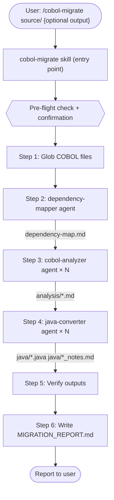

# COBOL Migration Workflow — Orchestration Plan

This document is the canonical reference for the Claude Code native COBOL → Java Quarkus
migration workflow. It describes how the agents collaborate, what each one does, and how to
run, extend, or debug the pipeline.

---

## Architecture Overview



---

## Agent Roster

| Agent               | File                          | Model                     | Role                                  |
| ------------------- | ----------------------------- | ------------------------- | ------------------------------------- |
| `dependency-mapper` | `agents/dependency-mapper.md` | claude-haiku-4-5-20251001 | Maps COPY/CALL relationships          |
| `cobol-analyzer`    | `agents/cobol-analyzer.md`    | claude-opus-4-6           | Analyzes COBOL structure + complexity |
| `java-converter`    | `agents/java-converter.md`    | claude-opus-4-6           | Generates Java Quarkus source         |

**Skill:** `skills/cobol-migrate.md` → invoked as `/cobol-migrate` in Claude Code

---

## Step-by-Step Pipeline

### Step 1 — File Discovery

**Tools:** Glob
**Input:** `COBOL_SOURCE` directory
**Output:** List of file paths

Find all files matching:

- `<source>/**/*.cbl` — main COBOL programs
- `<source>/**/*.cpy` — copybooks (shared data definitions)
- `<source>/**/*.cob` — alternate extension

**Stop condition:** If zero files found, abort with clear error.

---

### Step 2 — Dependency Analysis

**Who:** `dependency-mapper` agent
**Tools:** Glob, Read, Write
**Input:** `COBOL_SOURCE` directory path
**Output:** `<JAVA_OUTPUT>/dependency-map.md`

What it produces:

- File inventory table
- Dependency matrix (source → target, COPY/CALL, line number)
- Mermaid diagram
- Migration wave order (topological sort)
- Circular dependency warnings
- Risk assessment per file

**Orchestrator uses:** The migration wave order from this report to sequence Steps 3 and 4.

---

### Step 3 — COBOL Analysis

**Who:** `cobol-analyzer` agent (one instance per file, sequential)
**Tools:** Glob, Read, Write, Bash
**Input:** Path to a single COBOL file
**Output:** `<JAVA_OUTPUT>/analysis/<filename>_analysis.md`

What each analysis report contains:

- Division breakdown (IDENTIFICATION, DATA, PROCEDURE)
- Data items table with PICTURE clauses
- Business logic summary
- Complexity metrics (cyclomatic, nesting depth, LOC)
- Migration complexity rating: `low` / `medium` / `high`
- Potential migration challenges
- Recommended Java class type and structure

**Ordering:** Files are processed in migration-wave order from Step 2.
If dependency map failed, alphabetical order is used as fallback.

---

### Step 4 — Java Conversion

**Who:** `java-converter` agent (one instance per file, sequential)
**Tools:** Read, Write, Bash
**Input:**

- COBOL source file path
- Corresponding analysis report path from Step 3
- `JAVA_OUTPUT` directory
  **Output:**
- `<JAVA_OUTPUT>/java/<package_path>/<ClassName>.java`
- `<JAVA_OUTPUT>/java/<ClassName>_conversion_notes.md`

What the Java file contains:

- Proper package declaration
- All required imports
- Full class with fields, constructor, methods, getters/setters
- Quarkus annotations appropriate to the class type
- JavaDoc for all public methods
- Compilable without modification (for straightforward conversions)

Conversion notes contain:

- Confidence score (0.0–1.0)
- Manual review flag (Yes/No)
- Table of COBOL pattern → Java implementation decisions
- List of items needing human attention
- Unit test recommendations

---

### Step 5 — Output Verification

**Tools:** Glob, Read
**Input:** Expected file list from Step 1 vs. actual files in `JAVA_OUTPUT`
**Output:** Verification summary (in orchestrator's working notes)

Checks:

- Every `.cbl` file should have a corresponding `.java` file
- Analysis reports exist for all files
- No empty or stub-only Java files (check for `UnsupportedOperationException` in body)

---

### Step 6 — Migration Report

**Tools:** Read, Write
**Input:** All outputs from Steps 1–5
**Output:** `<JAVA_OUTPUT>/MIGRATION_REPORT.md`

Report sections:

- Executive summary (counts, rates)
- Migration waves (from dependency map)
- Full file mapping table (COBOL → Java, confidence, status)
- Files requiring manual review with links to notes
- Circular dependencies (if any)
- Recommended next steps

---

## Output Directory Structure

```
<JAVA_OUTPUT>/
├── MIGRATION_REPORT.md              ← Executive summary and file mapping
├── dependency-map.md                ← COPY/CALL graph + migration order
├── analysis/
│   ├── CUSTMNT_analysis.md          ← One per input COBOL file
│   ├── VALRTN_analysis.md
│   └── CUSTDATA_analysis.md
└── java/
    ├── com/
    │   └── example/
    │       ├── customer/
    │       │   └── CustMnt.java
    │       └── validation/
    │           └── Valrtn.java
    ├── CustMnt_conversion_notes.md
    └── Valrtn_conversion_notes.md
```

---

## Error Handling Strategy

| Scenario                           | Behavior                                                |
| ---------------------------------- | ------------------------------------------------------- |
| No COBOL files found               | Abort immediately, show directory listing               |
| `dependency-mapper` fails          | Log warning, fall back to alphabetical order, continue  |
| `cobol-analyzer` fails on one file | Log error, mark file as failed, continue with remaining |
| `java-converter` fails on one file | Log error, mark as `manual_review_required`, continue   |
| All agents fail                    | Stop, report infrastructure issue (check API key)       |
| Output dir doesn't exist           | Create it automatically                                 |

**Key principle:** A failure on one file never stops the migration of other files.

---

## Running the Migration

### Via Claude Code Skill (recommended)

```
/cobol-migrate ./my-cobol-source ./java-output
```
