# CLAW: Elixir Agent Platform — Architecture Reference

> **Derived from** `chatgpt/elixir-claw.md` · **Status:** Living Document  
> **Purpose:** Implementation-grade reference for building the CLAW agent platform — an OTP-native equivalent of OpenClaw / Codex CLI / Gemini CLI in Elixir.

---

## Table of Contents

- [Part 0 — Front Matter](#part-0--front-matter)
  - [0.1 How to Read This Document](#01-how-to-read-this-document)
  - [0.2 Glossary](#02-glossary)
- [Part 1 — Foundations](#part-1--foundations)
  - [Chapter 1: Product Definition & Non-Goals](#chapter-1-product-definition--non-goals)
  - [Chapter 2: Architectural Principles](#chapter-2-architectural-principles)
  - [Chapter 3: System Context & Containers](#chapter-3-system-context--containers)
- [Part 2 — Runtime Architecture](#part-2--runtime-architecture)
  - [Chapter 4: OTP Supervision Tree](#chapter-4-otp-supervision-tree)
  - [Chapter 5: Session Lifecycle](#chapter-5-session-lifecycle)
  - [Chapter 6: Bounded Contexts & Module Layout](#chapter-6-bounded-contexts--module-layout)
- [Part 3 — The Engine](#part-3--the-engine)
  - [Chapter 7: Run Lifecycle & State Machine](#chapter-7-run-lifecycle--state-machine)
  - [Chapter 8: The Tick Loop](#chapter-8-the-tick-loop)
  - [Chapter 9: Planner, Policy & Executor](#chapter-9-planner-policy--executor)
  - [Chapter 9A: Approvals, Failures & Cancellation](#chapter-9a-approvals-failures--cancellation)
- [Part 4 — Capabilities](#part-4--capabilities)
  - [Chapter 10: Memory Architecture](#chapter-10-memory-architecture)
  - [Chapter 11: Tool System](#chapter-11-tool-system)
  - [Chapter 12: LLM Broker & Providers](#chapter-12-llm-broker--providers)
  - [Chapter 13: Channels & Event Contract](#chapter-13-channels--event-contract)
  - [Chapter 14: Skills & Plugin Architecture](#chapter-14-skills--plugin-architecture)
- [Part 5 — Multi-Agent](#part-5--multi-agent)
  - [Chapter 15: Teams Mode Overview](#chapter-15-teams-mode-overview)
  - [Chapter 16: Handoffs & Child Runs](#chapter-16-handoffs--child-runs)
  - [Chapter 17: Coordination Patterns](#chapter-17-coordination-patterns)
- [Part 6 — Cross-Cutting Concerns](#part-6--cross-cutting-concerns)
  - [Chapter 18: Data Architecture & Schema](#chapter-18-data-architecture--schema)
  - [Chapter 19: Security & Policy](#chapter-19-security--policy)
  - [Chapter 20: Observability & Telemetry](#chapter-20-observability--telemetry)
- [Part 7 — Delivery & Reference](#part-7--delivery--reference)
  - [Chapter 21: Delivery Roadmap](#chapter-21-delivery-roadmap)
  - [Chapter 22: Anti-Patterns Catalog](#chapter-22-anti-patterns-catalog)
  - [Chapter 23: Architecture Decision Records](#chapter-23-architecture-decision-records)
  - [Chapter 24: Open Questions & TBDs](#chapter-24-open-questions--tbds)

---

## Part 0 — Front Matter

### 0.1 How to Read This Document

This document is organized by **concept**, not by conversation turn. Every concept lives in exactly one chapter. Diagrams are numbered `D1`–`D32` for stable cross-references. Decisions carry stable IDs `ADR-0001`–`ADR-0020` (all bodies in Ch 23; short rationale inline). Gaps carry `TBD-01`–`TBD-27` (all bodies in Ch 24; referenced inline).

**Reading paths by audience:**

| Audience | Start | Key chapters |
|----------|-------|--------------|
| New to CLAW | Part 0 → Part 1 | Ch 1, 2, 3 |
| Implementing the engine | Ch 4 → Ch 9A | Ch 7, 8, 9 |
| Implementing memory | Ch 10 | Ch 10, 18 |
| Implementing tools | Ch 11 | Ch 11, 19 |
| Implementing teams | Ch 15–17 | Ch 7, 15, 16, 17 |
| Design review | Ch 22, 23, 24 | Ch 22, 23, 24 |
| New ADR author | Ch 23 | Ch 23 |

**Stable identifiers used throughout:**
- `D1`–`D32` — diagram IDs (each diagram appears exactly once)
- `ADR-0001`–`ADR-0020` — architecture decisions (all in Ch 23)
- `TBD-01`–`TBD-27` — open questions (all in Ch 24)

---

### 0.2 Glossary

| Term | Definition |
|------|-----------|
| **Agent** | A reusable configuration (definition/template): id, system_prompt, model, tool_names, memory_scope, handoff_targets, approval_policy. NOT a process. |
| **Run** | One live execution instance of an agent. Lives as a supervised GenServer. Has status, step_count, budget, messages, scratchpad, results, child_runs. |
| **Session** | The broader conversation/work context spanning multiple runs. Holds user messages, files, memory_refs, active_run_id, permissions. |
| **Step** | One atomic action taken by the engine within a run: model reasoning, tool call, handoff, final response, or user question. Every step is persisted. |
| **Tool** | A validated executable capability. Implements the `ToolDefinition` behavior. Has spec (name, description, schema, permissions, timeout, idempotent) and run/2. |
| **Handoff** | A first-class action that spawns a child run in another agent. Carries task, input_artifacts, memory_scope, and return_mode. |
| **Team** | A set of agent definitions plus coordination rules. One coordinator + N specialists. |
| **Scope (memory)** | Visibility boundary for memory: run-local, task-shared, session-shared, or workspace-global. See Ch 10. |
| **Broker** | The LLM abstraction layer. Dispatches to providers (OpenAI, Anthropic, Ollama), handles failover and cost routing. |
| **Channel** | An I/O adapter (Web, CLI, Slack, Telegram). Normalizes into InboundEvent/OutboundEvent. |
| **Policy** | The gate between planner and executor. Validates tool allowlist, approval requirement, budget, scope, and handoff targets. |
| **Scratchpad** | Short-term key-value store inside RunState for in-flight reasoning (awaited child IDs, approval decisions, intermediate notes). |
| **Tick** | One execution of the engine loop: context build → plan → validate → execute → handle_outcome. |
| **Action** | Structured JSON output from the planner: one of tool_call, handoff, ask_user, final_response, wait, noop. |
| **Budget** | Per-run limits: `%{tokens: integer, tool_calls: integer}`. See TBD-06. |

---

## Part 1 — Foundations

### Chapter 1: Product Definition & Non-Goals

#### 1.1 What CLAW Is

CLAW is an **agent platform, not just a chatbot**. It is a local-first, OTP-native personal agent platform with strong supervision, secure tool execution, and channel-first automation. Think of it as the Elixir equivalent of OpenClaw, Codex CLI, or Gemini CLI — a harness that wraps an LLM in a managed execution loop with state, tools, memory, approvals, scheduling, and multi-channel I/O.

**At minimum the system must support:**

| Capability | Why it matters |
|---|---|
| Persistent user/workspace identity | Continuity across sessions |
| Conversational sessions | Contextual interaction |
| Tool calling | Real-world actions |
| Background jobs | Proactive / async behavior |
| Memory (4 layers) | Context beyond the context window |
| Multi-channel I/O | Web, CLI, Slack, Telegram |
| Secure execution boundaries | Safety for real-world actions |
| Observability | Debuggability and replay |
| Skills/plugins | Extensibility |

**Position:** Instead of "OpenClaw clone," CLAW is defined as a *more reliable, more inspectable, and more operationally safe* alternative — one that uses OTP supervision, explicit state machines, and a strict policy engine to make agent behavior deterministic and auditable. See ADR-0001.

#### 1.2 What CLAW Is Not (Non-Goals)

These are explicitly out-of-scope for v1 to keep velocity high and the core solid:

- Full multi-channel surface (more than 3 channels)
- Live canvas / collaborative UI
- Mobile nodes
- Autonomous skill authoring
- Huge plugin marketplace
- Multi-machine distributed deployment (see ADR-0020 and TBD-24)

#### 1.3 v1 Scope

| Capability | Detail |
|---|---|
| local-first single-user install | Docker single-node |
| Web UI | Phoenix LiveView or SPA |
| CLI | STDIO adapter |
| One messaging channel | Telegram or Slack |
| One agent | Coordinator with static team |
| Session persistence | Postgres-backed |
| Memory | Working + Episodic (Semantic optional) |
| 5–8 safe tools | web_fetch, file_read/write, shell_allowlist, calendar, email_draft, notes, reminder, workflow_runner |
| Scheduler/reminders | Oban cron |
| Approval workflow | Pause + UI confirmation |
| Telemetry dashboard | Basic LiveDashboard |
| Provider abstraction | OpenAI + Anthropic |

#### 1.4 v2 Scope

Add after v1 is stable: multi-agent routing, team workspaces, shared memory scopes, richer skill system, browser automation, voice, mobile companion, artifact generation, model routing policies, policy packs for enterprise.

---

### Chapter 2: Architectural Principles

These principles are **non-negotiable invariants**. Any design that violates them requires an ADR update and team discussion.

#### 2.1 Core Invariants

| # | Invariant | Where it is enforced |
|---|---|---|
| I-1 | Model proposes one action at a time; engine decides what happens | Policy engine (Ch 9) |
| I-2 | Every run has bounded loops (max_steps, max_tool_calls, max_tokens, max_wall_clock) | Loop tick guard (Ch 8) |
| I-3 | Every step is persisted before execution and its result persisted after | StepStore (Ch 7, ADR-0017) |
| I-4 | Session crashes are isolated — they never propagate to other sessions | DynamicSupervisor (Ch 4, ADR-0018) |
| I-5 | Tools get only the capabilities they need, via scoped tokens | Policy + Capability tokens (Ch 11, 19, ADR-0019) |
| I-6 | Dangerous tools always run in an isolated OS process or container | Sandbox (Ch 11, ADR-0013) |
| I-7 | Run state machine has explicit wait states — no implicit blocking | RunServer state machine (Ch 7, ADR-0007) |
| I-8 | The planner returns structured JSON; free-form text is a parsing error | Action parser (Ch 9, ADR-0008) |

#### 2.2 Execution Model: Model Proposes, Engine Executes

> **The one rule that keeps CLAW stable:** The LLM proposes the next action. The Elixir runtime decides whether it is allowed, validates its inputs, executes it safely, and records the result. The model never directly calls tools, reads state, or controls the loop — it answers one question: "What is the next best step?" See ADR-0006.

This creates a clean boundary:

```
LLM (stateless, external)
  ↕  one JSON action per tick
Policy Engine (Elixir, validates + approves)
  ↕  validated action
Step Executor (Elixir, runs in OTP process)
```

Consequence: swapping the LLM provider never changes execution semantics. Testing the engine never requires calling an LLM. See ADR-0006, ADR-0009.

#### 2.3 Bounded Loops

Every run has hard limits. Reaching any limit transitions the run to `:failed` with `last_error: :limit_exceeded`.

| Limit | Default | Field in RunState |
|---|---|---|
| Max steps | 20 | `max_steps` |
| Max tool calls | 20 | `budget.tool_calls` |
| Max tokens | 100,000 | `budget.tokens` |
| Max wall clock | configurable | checked per tick |

These are per-run, not cumulative across child runs (TBD-06 tracks the child-budget inheritance question).

#### 2.4 Checkpoint Everything

Every step writes to `steps` table:
1. **Before execution:** `action_type`, `action_payload`, `status: :planned`
2. **After execution:** `result_payload`, `status: :completed | :failed`

This enables: crash recovery (re-read last completed step on restart), replay (reconstruct any run's exact sequence), debugging (full audit trail), and approval re-evaluation (what was the planner thinking?). See ADR-0017.

#### 2.5 Least Privilege & Capability Tokens

Tools never receive global credentials. Instead, the policy engine mints **capability tokens** — short-lived, scoped credentials:

- `read-only file token` — path-restricted read access
- `Gmail send token` — specific account, send-only, expires in 5 min
- `browser session token` — sandboxed browser instance ID

Format: signed map `%{run_id, tool_name, scope, exp, nonce}` — see TBD-03 for the full format decision.

Dangerous tools additionally run in isolated processes so that even a compromised tool cannot escape its sandbox. See ADR-0013, ADR-0019.

#### 2.6 Session & Run Isolation

**Sessions**: each active session is a separate `GenServer` under `DynamicSupervisor`. A session crash restarts only that session. No shared mutable state between sessions. See ADR-0018.

**Runs**: each run is also a separate `GenServer`. A run crash kills only that run — the session remains alive and can start a new run. Parent/child run trees use message-passing (not shared ETS) for result propagation.

#### 2.7 Explicit State Machine Over Implicit Control Flow

The run lifecycle is a formal state machine with defined states and allowed transitions (see D7, Ch 7). No implicit blocking — every wait state is explicit (`:waiting_approval`, `:waiting_child`, `:waiting_user`, `:waiting`). This makes the system inspectable: at any moment you can look at a run's `:status` and know exactly what it is waiting for and why. See ADR-0007.

---

### Chapter 3: System Context & Containers

#### 3.1 System Context (C4 Level 1)

CLAW sits between users (human, programmatic) and external systems (LLM providers, tools, channels). The system boundary is the Phoenix/OTP node.

**D1 — C4 System Context**

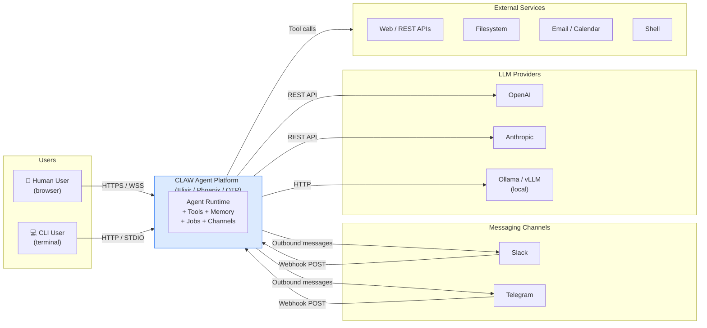

#### 3.2 Container Diagram (C4 Level 2)

All containers run inside a **single Phoenix/OTP BEAM node** (see ADR-0020). Internal boundaries are Elixir module contexts — they can be extracted to separate services later with minimal protocol changes because they already communicate via Phoenix PubSub events and well-defined function calls.

**D2 — C4 Container Diagram**

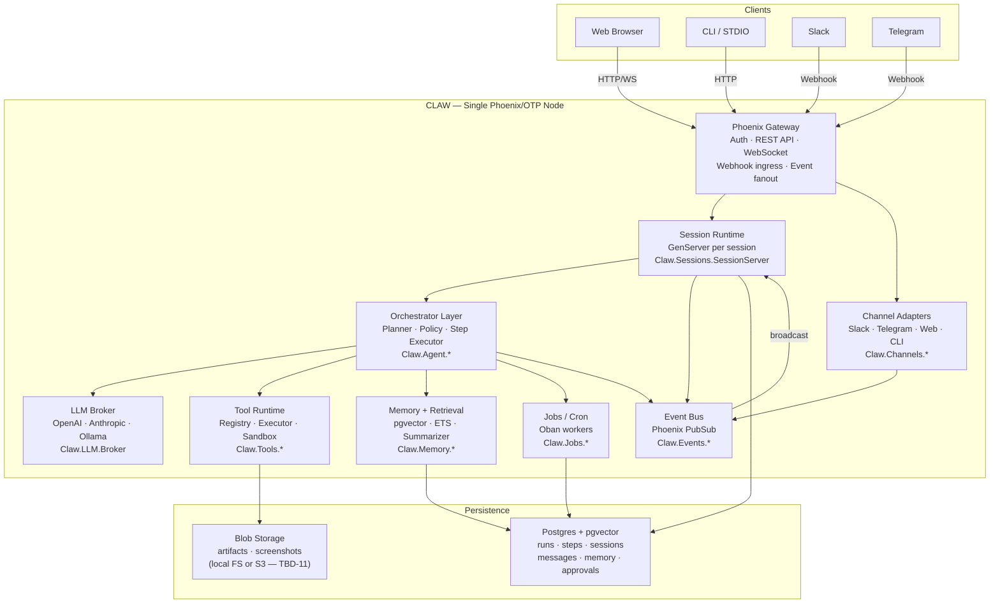

#### 3.3 Module Dependency Graph

This graph is **directed-only** (no cycles allowed). It enforces which Elixir contexts may call which. Any PR that adds an edge not shown here must be discussed.

**D3 — Module Dependency Graph**

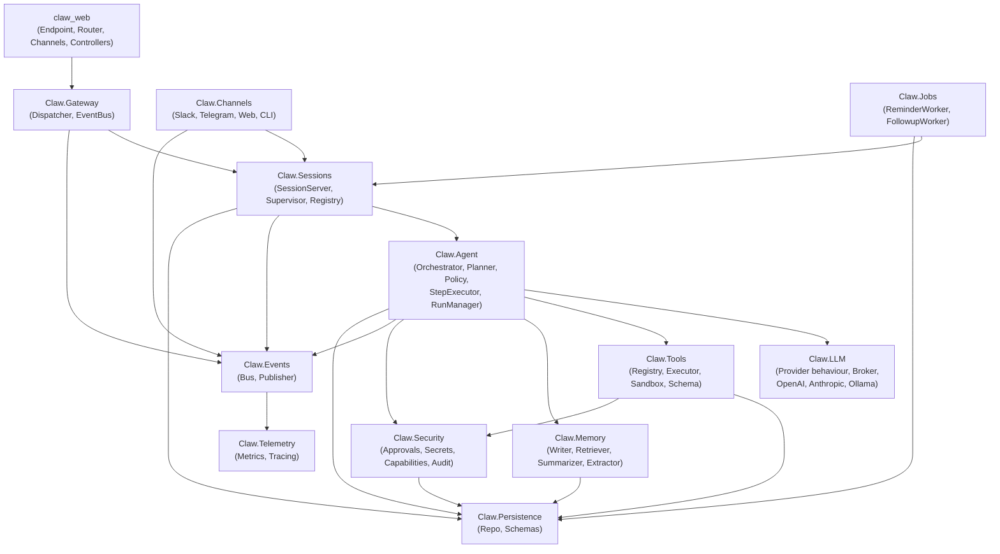

**Rules enforced by this graph:**

- `claw_web` only calls `Claw.Gateway` — never directly into sessions or agent
- `Claw.Channels` never calls `Claw.Agent` directly — goes through `Claw.Sessions`
- `Claw.Agent` never calls `claw_web` — events flow via `Claw.Events.Publisher`
- `Claw.Persistence` has no outbound calls — it is a pure data layer

---

## Part 2 — Runtime Architecture

### Chapter 4: OTP Supervision Tree

> **Rationale.** OTP supervision is the primary fault-tolerance mechanism. Every long-lived process must live under a supervisor. `DynamicSupervisor` is used for runtime-spawned processes (sessions, runs, channel workers) so the tree grows and shrinks without restarts. Static children use `one_for_one` strategy so unrelated children are independent. See ADR-0001, ADR-0005.

#### 4.1 Full Supervision Tree

**D4 — OTP Supervision Tree**

```mermaid
graph TD
  App["Claw.Application\n(OTP Application entry)"]

  App --> AppSup["Claw.Supervisor\nstrategy: one_for_one"]

  AppSup --> TelSup["Claw.TelemetrySupervisor\none_for_one"]
  AppSup --> Repo["Claw.Persistence.Repo\n(Ecto, DB pool)"]
  AppSup --> PubSub["Phoenix.PubSub\n:claw_pubsub"]
  AppSup --> Presence["Phoenix.Presence"]
  AppSup --> RunReg["Registry\nname: Claw.RunRegistry\nkeys: :unique"]
  AppSup --> SessReg["Registry\nname: Claw.SessionRegistry\nkeys: :unique"]
  AppSup --> SessSup["DynamicSupervisor\nname: Claw.SessionSupervisor\none_for_one"]
  AppSup --> RunSup["DynamicSupervisor\nname: Claw.RunSupervisor\none_for_one"]
  AppSup --> ChanSup["DynamicSupervisor\nname: Claw.ChannelSupervisor\none_for_one"]
  AppSup --> ToolSup["DynamicSupervisor\nname: Claw.ToolWorkerSupervisor\none_for_one"]
  AppSup --> Oban["Oban\n(job queue, cron)"]
  AppSup --> CacheSup["Claw.CacheSupervisor\n(ETS tables)"]
  AppSup --> AgentReg["Claw.Agents.Registry\n(GenServer, agent defs)"]
  AppSup --> ToolReg["Claw.Tools.Registry\n(GenServer, tool defs)"]
  AppSup --> EventBus["Claw.Events.Bus\n(PubSub wrapper)"]
  AppSup --> Endpoint["ClawWeb.Endpoint\n(Phoenix HTTP/WS)"]

  SessSup -->|"spawns"| SessServer["Claw.Sessions.SessionServer\n(one per active session)"]
  RunSup -->|"spawns"| RunServer["Claw.Runs.RunServer\n(one per active run)"]
  ChanSup -->|"spawns"| ChanWorker["Claw.Channels.*.Worker\n(per channel connection)"]
  ToolSup -->|"spawns"| ToolWorker["Claw.Tools.Workers.*\n(sandboxed tool processes)"]

  TelSup --> TelMetrics["Claw.Telemetry.Metrics"]
  TelSup --> TelTracing["Claw.Telemetry.Tracing"]
```

#### 4.2 Strategy Rationale per Supervisor

| Supervisor | Strategy | Reason |
|---|---|---|
| `Claw.Supervisor` (root) | `one_for_one` | Children are independent; Repo restart must not restart Endpoint |
| `DynamicSupervisor(Session)` | `one_for_one` | Session crashes are isolated per user |
| `DynamicSupervisor(Run)` | `one_for_one` | Run crashes isolated per run; parent session unaffected |
| `DynamicSupervisor(Channel)` | `one_for_one` | Channel adapter crash does not affect other channels |
| `DynamicSupervisor(ToolWorker)` | `one_for_one` | Sandboxed worker crash kills only that tool call |
| `Claw.TelemetrySupervisor` | `one_for_one` | Metrics and tracing are independent |
| `Claw.CacheSupervisor` | `one_for_one` | ETS owner processes are independent |

#### 4.3 Registry Layout

Three registries provide O(1) pid lookup by stable key:

| Registry | Key | Value | Used by |
|---|---|---|---|
| `Claw.RunRegistry` | `run_id` (string) | `pid` | `RunManager.cancel_run/1`, `ChildCompletionHook` |
| `Claw.SessionRegistry` | `session_id` (string) | `pid` | `Gateway.Dispatcher`, channel adapters |
| `Claw.Agents.Registry` (GenServer) | `agent_id` (string) | `%AgentDefinition{}` | `RunManager.create_run/1` |
| `Claw.Tools.Registry` (GenServer) | `tool_name` (atom) | module | `Tools.Executor` |

Both `RunRegistry` and `SessionRegistry` use `{:via, Registry, {name, key}}` for named process registration.

#### 4.4 Implementation Checklist

- [ ] `Claw.Application.start/2` — children list in dependency order (Repo before Oban, Registries before Supervisors)
- [ ] `Claw.Sessions.SessionServer` starts under `Claw.SessionSupervisor` via `DynamicSupervisor.start_child/2`
- [ ] `Claw.Runs.RunServer` starts under `Claw.RunSupervisor` via `DynamicSupervisor.start_child/2`
- [ ] Both registries use `keys: :unique` — duplicate key returns `{:error, {:already_registered, pid}}`
- [ ] `Claw.Agents.Registry` pre-loads preset agent definitions on `init/1`
- [ ] `Claw.Tools.Registry` pre-loads built-in tool modules on `init/1`
- [ ] Verify with `:observer.start()` or `Claw.Supervisor |> Supervisor.which_children()`

---

### Chapter 5: Session Lifecycle

> **Rationale.** A session is a long-lived process that owns conversation context. It is the stable identity that survives across multiple runs, channel reconnections, and even node restarts (via DB-backed state). Session-level state (messages, permissions, memory_refs) is separate from run-level state (scratchpad, step_count, child_runs) so that a failed run never corrupts the session. See ADR-0018.

#### 5.1 Session State Machine

Sessions have a coarse-grained lifecycle. Note: this is *session-level* state, distinct from the finer-grained *run-level* state machine (D7 in Ch 7).

**D5 — Session State Machine**

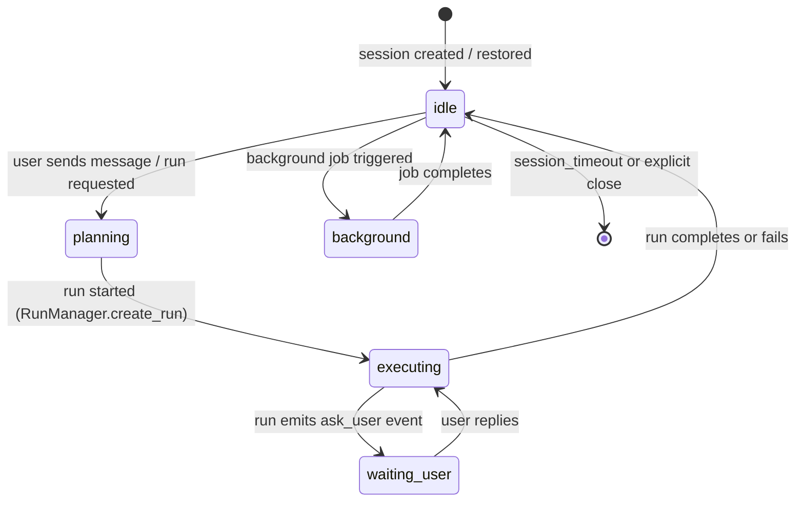

**State meanings:**

| State | Meaning |
|---|---|
| `:idle` | No active run; session is waiting for user input or a trigger |
| `:planning` | Run is being created and initialized |
| `:executing` | A run is actively ticking (tool calls, LLM calls) |
| `:waiting_user` | Engine emitted `ask_user` — awaiting human reply |
| `:background` | A background job run is in progress (no interactive user wait) |

#### 5.2 Session Lifecycle Sequence

**D6 — Session Lifecycle Sequence**

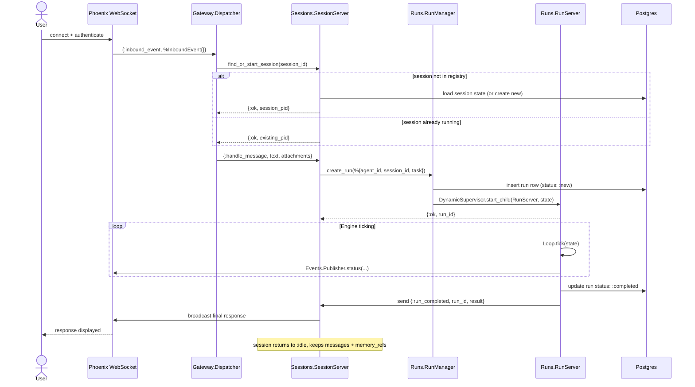

#### 5.3 SessionState Schema

```elixir
%Claw.Sessions.SessionState{
  session_id:    String.t(),          # UUID, stable across reconnects
  workspace_id:  String.t(),          # tenant/workspace boundary (TBD-02)
  user_id:       String.t(),          # authenticated user
  mode:          :interactive | :background,
  messages:      [%Message{}],        # full conversation history (trimmed for prompt — TBD-13)
  scratchpad:    map(),               # short-term, session-scoped k/v
  tool_context:  map(),               # active tool session tokens
  memory_refs:   [String.t()],        # IDs of retrieved memory records
  status:        :idle | :planning | :executing | :waiting_user | :background,
  active_run_id: String.t() | nil,    # currently executing run, if any
  permissions:   map()                # capability grants (TBD-04)
}
```

**Persisted fields** (written to `sessions` table on change): `session_id`, `workspace_id`, `user_id`, `status`, `active_run_id`.

**In-memory only** (lost on crash, reconstructed from DB): `messages` (rebuilt from `messages` table), `memory_refs` (retrieved fresh), `tool_context` (rebuilt on reconnect).

#### 5.4 Implementation Checklist

- [ ] `Claw.Sessions.SessionServer` registered via `{:via, Registry, {Claw.SessionRegistry, session_id}}`
- [ ] `init/1` loads session from DB or creates a new row
- [ ] `handle_call({:handle_message, ...})` creates a run via `RunManager`
- [ ] `handle_info({:run_completed, run_id, result})` updates status to `:idle`, stores result in messages
- [ ] `handle_info({:ask_user, run_id, question})` broadcasts to WS, updates status to `:waiting_user`
- [ ] Session timeout (configurable, e.g. 30 min idle) gracefully stops the process — DB state is preserved
- [ ] Session restart (process crash) reads state from DB, not from in-memory — idempotent init

---

### Chapter 6: Bounded Contexts & Module Layout

Each bounded context is an **Elixir module namespace** with defined public API and internal invariants. The D3 dependency graph (Ch 3) governs which contexts may call which.

#### 6.1 Context Map

| Context | Public API boundary | Key invariant |
|---|---|---|
| **Gateway** | `Claw.Gateway.Dispatcher.dispatch/1` | Routes to sessions; never touches agent state directly |
| **Sessions** | `SessionServer.handle_message/2`, `create_session/1` | One process per session; DB-backed on restart |
| **Orchestrator** | `RunManager.create_run/1`, `RunManager.cancel_run/1` | Engine loop is the only place that advances run state |
| **Tools** | `Tools.Registry.fetch/1`, `Tools.Executor.execute/3` | Tool execution always goes through policy check first |
| **Memory** | `Memory.Retriever.fetch/1`, `Memory.Writer.maybe_persist/1` | Write is always async/post-run; never in the hot loop |
| **Channels** | `Channels.*.normalize/1`, `Channels.*.send/2` | Adapters produce/consume only InboundEvent/OutboundEvent |
| **Jobs** | Oban worker `perform/1` callbacks | Jobs can only interact with sessions, not directly with agent |
| **Observability** | `:telemetry.execute/3`, `Publisher.*` | Events flow out only; no feedback loops |

#### 6.2 Gateway Context

- `ClawWeb.Endpoint` — Phoenix HTTP + WS entry
- `ClawWeb.Router` — REST routes + WS channels
- `ClawWeb.Channels.AgentChannel` — WebSocket per session
- `Claw.Gateway.Dispatcher` — routes `%InboundEvent{}` to the right `SessionServer`

#### 6.3 Sessions Context

- `Claw.Sessions.SessionServer` — long-lived GenServer (one per session)
- `Claw.Sessions.Supervisor` — the `DynamicSupervisor` for sessions
- `Claw.Sessions.Registry` — session lookup by `session_id`
- `Claw.Sessions.SessionState` — struct + persistence helpers

#### 6.4 Orchestrator Context

- `Claw.Agent.Orchestrator` — top-level coordinator (may be merged with RunManager in v1)
- `Claw.Agent.RunManager` — create/cancel/lookup runs
- `Claw.Runs.RunServer` — per-run GenServer
- `Claw.Runs.RunState` — struct
- `Claw.Engine.Loop` — the tick function
- `Claw.Engine.ContextBuilder` — assembles model input
- `Claw.Engine.Planner` — LLM call + response parsing
- `Claw.Engine.ActionParser` — JSON → typed action struct
- `Claw.Engine.Policy` — validates action against allowlist + budget
- `Claw.Engine.StepExecutor` — dispatches validated action
- `Claw.Runs.HandoffManager` — spawns child runs
- `Claw.Runs.ResultAggregator` — merges child results
- `Claw.Runs.ChildCompletionHook` — notifies parent on child done
- `Claw.Persistence.StepStore` — persists step before/after execution

#### 6.5 Tools Context

- `Claw.Tools.ToolDefinition` — `@behaviour` (spec/0, run/2)
- `Claw.Tools.Registry` — GenServer mapping atom → module
- `Claw.Tools.Executor` — calls `Registry.fetch` then `mod.run/2`
- `Claw.Tools.Schema` — input/output schema validation (TBD-17)
- `Claw.Tools.Sandbox` — spawn/monitor isolated OS processes for dangerous tools
- `Claw.Tools.Builtins.ReadFile`, `WriteFile`, `WebSearch`, `ShellCommand`, etc.

#### 6.6 Memory Context

- `Claw.Memory.Retriever` — fetch relevant records (ETS → DB → pgvector)
- `Claw.Memory.Writer` — post-run persistence with scoring
- `Claw.Memory.Summarizer` — condense run output (calls LLM broker)
- `Claw.Memory.Extractor` — pull structured facts from summaries

#### 6.7 Channels Context

- `Claw.Channels.Adapter` — behaviour (`normalize_inbound/1`, `send_outbound/2`)
- `Claw.Channels.Slack`, `Telegram`, `Web`, `CLI` — adapter implementations
- Each adapter normalizes to `%InboundEvent{}` / consumes `%OutboundEvent{}`

#### 6.8 Jobs Context

- `Claw.Jobs.ReminderWorker` — Oban worker, fires `SessionServer.handle_message`
- `Claw.Jobs.FollowupWorker` — delayed follow-up after run completion
- Future: `PollingWorker`, `RecurringWorkflowWorker`

#### 6.9 Observability Context

- `Claw.Telemetry.Metrics` — `:telemetry.attach` handlers for LiveDashboard
- `Claw.Telemetry.Tracing` — OpenTelemetry span management
- `Claw.Audit` — append-only audit log writes (who/what/when/why)
- `Claw.Events.Publisher` — thin wrapper over `Phoenix.PubSub.broadcast`

#### 6.10 Full Module File Tree

```text
lib/
  claw/
    application.ex          # OTP Application, children list
    repo.ex                 # Ecto repo

    gateway/
      dispatcher.ex
      event_bus.ex

    sessions/
      session_server.ex
      session_state.ex
      supervisor.ex
      registry.ex

    agent/                  # Orchestrator context (may rename to runs/)
      orchestrator.ex
      planner.ex
      policy.ex
      step_executor.ex
      run_manager.ex

    runs/
      run_server.ex
      run_state.ex
      run_supervisor.ex
      handoff_manager.ex
      result_aggregator.ex
      child_completion_hook.ex

    engine/
      loop.ex
      context_builder.ex
      action_parser.ex

    llm/
      provider.ex           # @behaviour
      broker.ex             # dispatcher + failover
      providers/
        openai.ex
        anthropic.ex
        ollama.ex

    tools/
      tool_definition.ex    # @behaviour
      registry.ex
      executor.ex
      sandbox.ex
      schema.ex
      builtins/
        read_file.ex
        write_file.ex
        web_search.ex
        shell_command.ex
        web_fetch.ex
        reminder.ex

    memory/
      retriever.ex
      writer.ex
      summarizer.ex
      extractor.ex

    channels/
      adapter.ex            # @behaviour
      slack.ex
      telegram.ex
      web.ex
      cli.ex

    jobs/
      reminder_worker.ex
      followup_worker.ex

    security/
      approvals.ex
      secrets.ex
      capabilities.ex
      audit.ex

    events/
      bus.ex
      publisher.ex

    persistence/
      repo.ex
      schemas/
        run.ex
        step.ex
        session.ex
        message.ex
        agent.ex
        artifact.ex
        approval.ex
        memory_record.ex

    telemetry/
      metrics.ex
      tracing.ex

  claw_web/
    endpoint.ex
    router.ex
    controllers/
      session_controller.ex
      run_controller.ex
    channels/
      agent_channel.ex
    live/
      dashboard_live.ex
```

#### 6.11 Implementation Checklist

- [ ] Each context has its own `test/` directory mirroring `lib/claw/<context>/`
- [ ] No cross-context module calls except via defined public API functions
- [ ] `Claw.Events.Publisher` is the only way to broadcast to WebSocket clients
- [ ] `Claw.Persistence.Repo` is only called from within the `persistence/` schemas or context-specific store modules — never from `engine/` or `sessions/` directly
- [ ] `Claw.Security.Audit` is called at every tool execution and approval decision

---

## Part 3 — The Engine

### Chapter 7: Run Lifecycle & State Machine

> **Rationale.** A run is a GenServer under `Claw.RunSupervisor`. This gives it: crash isolation (run crash does not propagate to session), OTP restart semantics, process dictionary–free state (all state is in `RunState`), and pid-based registry lookup. Runs are not long-lived by design — they complete, fail, or get cancelled. Parent/child run relationships use message passing, not shared state, to maintain isolation. See ADR-0005, ADR-0007.

#### 7.1 Run Lifecycle State Machine

The run status progresses through a formal state machine. Every transition is a `%{state | status: new_status}` assignment inside `RunServer`.

**D7 — Run Lifecycle State Machine**

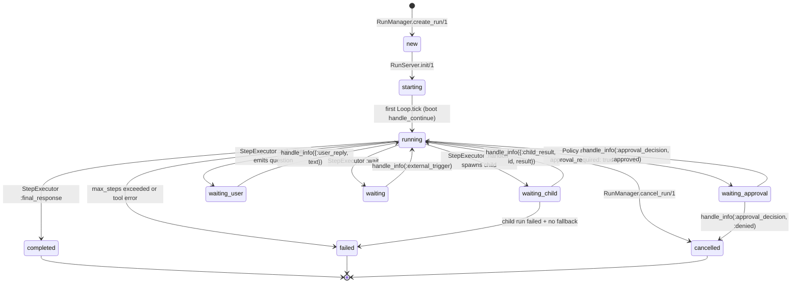

**Wait states explained:**

| Wait state | Blocked on | Resumes via |
|---|---|---|
| `:waiting_approval` | Human/system approval decision | `{:approval_decision, :approved | :denied}` message |
| `:waiting_child` | Child run completing | `{:child_result, child_run_id, result}` message |
| `:waiting_user` | User typing a reply | `{:user_reply, text}` routed by SessionServer |
| `:waiting` | External event or timeout | `{:external_trigger}` or Oban job |

#### 7.2 Run Parent/Child Tree

Child runs are spawned via `HandoffManager.spawn_child_run/2`. They are independent `RunServer` processes — they share no ETS state with the parent. The parent's `scratchpad[:waiting_on_child]` tracks the relationship.

**D8 — Run Parent/Child Tree**

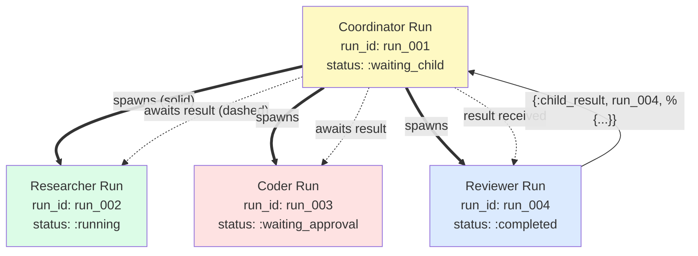

**Invariants:**
- A child run does not know its parent's scratchpad — it only knows `parent_run_id`
- On completion, `ChildCompletionHook.notify_parent_if_needed/1` looks up the parent pid via `RunRegistry` and sends `{:child_result, run_id, result}`
- A parent can have N concurrent children — all tracked in `RunState.child_runs`
- Depth limit: child runs should not spawn further grandchildren in v1 (TBD-07)

#### 7.3 RunState Schema

```elixir
%Claw.Runs.RunState{
  run_id:          String.t(),         # "run_" <> 16 hex chars
  session_id:      String.t(),
  parent_run_id:   String.t() | nil,   # nil for top-level runs
  agent:           %AgentDefinition{}, # full definition (not just ID)

  task:            String.t(),         # the task description given to this run
  status:          :new | :starting | :running | :waiting_approval
                   | :waiting_child | :waiting_user | :waiting
                   | :completed | :failed | :cancelled,

  step_count:      non_neg_integer(),  # incremented after each tick
  max_steps:       pos_integer(),      # from agent definition or default 12

  budget: %{
    tokens:     non_neg_integer(),     # remaining token budget (TBD-06)
    tool_calls: non_neg_integer()      # remaining tool call budget
  },

  messages:        [map()],            # [{role: :user/:assistant/:tool, content: ...}]
  scratchpad:      map(),              # in-flight k/v (waiting_on_child, approval_decision, etc.)
  memory_refs:     [String.t()],       # IDs of retrieved memory records
  artifacts:       [String.t()],       # IDs of produced artifacts
  child_runs:      [String.t()],       # run_ids of spawned children
  pending_approval: map() | nil,       # the action awaiting approval

  results:         [map()],            # accumulated tool/step results
  last_error:      term() | nil,       # last failure reason

  inserted_at:     DateTime.t(),
  updated_at:      DateTime.t()
}
```

#### 7.4 Run Manager

`Claw.Runs.RunManager` is the public API for run operations. All other modules must go through it — no direct `RunServer` calls from outside the engine.

```elixir
# Create a new run (most common)
{:ok, %{run_id: id, pid: pid}} =
  RunManager.create_run(%{
    agent_id:   "coordinator",
    session_id: "sess_001",
    task:       "Analyze the codebase and propose refactors"
  })

# Cancel a running run
:ok = RunManager.cancel_run("run_abc123")

# Approve/deny a pending action
:ok = RunManager.send_approval("run_abc123", :approved)

# Get current status
{:ok, status} = RunManager.get_status("run_abc123")
```

#### 7.5 Implementation Checklist

- [ ] `RunState.run_id` generated by `RunManager` (never by caller)
- [ ] `RunServer.init/1` registers via `{:via, Registry, {Claw.RunRegistry, run_id}}`
- [ ] `handle_continue(:boot, state)` drives the tick loop via `Loop.tick/1`
- [ ] Every status transition writes to DB via `StepStore.update_run_status/2`
- [ ] `handle_info({:child_result, ...})` calls `ResultAggregator.merge_child_result/3` then re-triggers `{:continue, :boot}`
- [ ] `handle_info({:approval_decision, :denied})` transitions to `:cancelled`, not `:failed`
- [ ] `max_steps` guard in `Loop.tick/1` must check BEFORE calling planner — not after
- [ ] Cancellation via `handle_call(:cancel)` must also cancel any running child runs (TBD-07)

---

### Chapter 8: The Tick Loop

> **Rationale.** The tick is stateless: it takes a `RunState` and returns `{outcome, new_state}`. The `RunServer` manages state between ticks. This separation means the tick logic can be unit-tested without a running GenServer, and the `RunServer` can be paused, inspected, resumed, or replayed by replaying `tick/1` calls against a known state. See ADR-0006.

#### 8.1 Tick Loop Flowchart

**D9 — Tick Loop Flowchart**

```mermaid
flowchart TD
  Start(["Loop.tick(state)"])

  Start --> CheckDone{status in\n:cancelled | :completed | :failed?}
  CheckDone -->|"yes"| Done(["return {:done, state}"])

  CheckDone -->|"no"| CheckSteps{step_count >=\nmax_steps?}
  CheckSteps -->|"yes"| Failed(["return {:failed, state\n| last_error: :max_steps_exceeded}"])

  CheckSteps -->|"no"| BuildCtx["ContextBuilder.build(state)\n→ {:ok, context}"]

  BuildCtx --> Plan["Planner.plan_next_step(state, context)\n→ {:ok, action}"]

  Plan --> ParseError{parse error?}
  ParseError -->|"yes"| FailedParse(["return {:failed, state}"])

  ParseError -->|"no"| Validate["Policy.validate(state, action)\n→ {:ok, validated} | {:error, reason}"]

  Validate --> PolicyDenied{policy\ndenied?}
  PolicyDenied -->|"yes"| FailedPolicy(["return {:failed, state\n| last_error: reason}"])

  PolicyDenied -->|"no"| Execute["StepExecutor.execute(state, validated_action)\n→ {:ok, {outcome, new_state}}"]

  Execute --> HandleOutcome{outcome?}

  HandleOutcome -->|":continue"| Cont(["return {:continue, increment_step(new_state)}"])
  HandleOutcome -->|":wait"| Wait(["return {:wait, increment_step(new_state)}"])
  HandleOutcome -->|":done"| DoneOut(["return {:done, new_state | status: :completed}"])
  HandleOutcome -->|":failed"| FailOut(["return {:failed, new_state | status: :failed}"])
```

#### 8.2 Happy-Path Sequence

This shows a complete tool call flow — user sends message, agent calls `read_file`, returns answer. It includes PubSub event emission so the WebSocket client sees streaming status.

**D10 — Happy-Path Sequence**

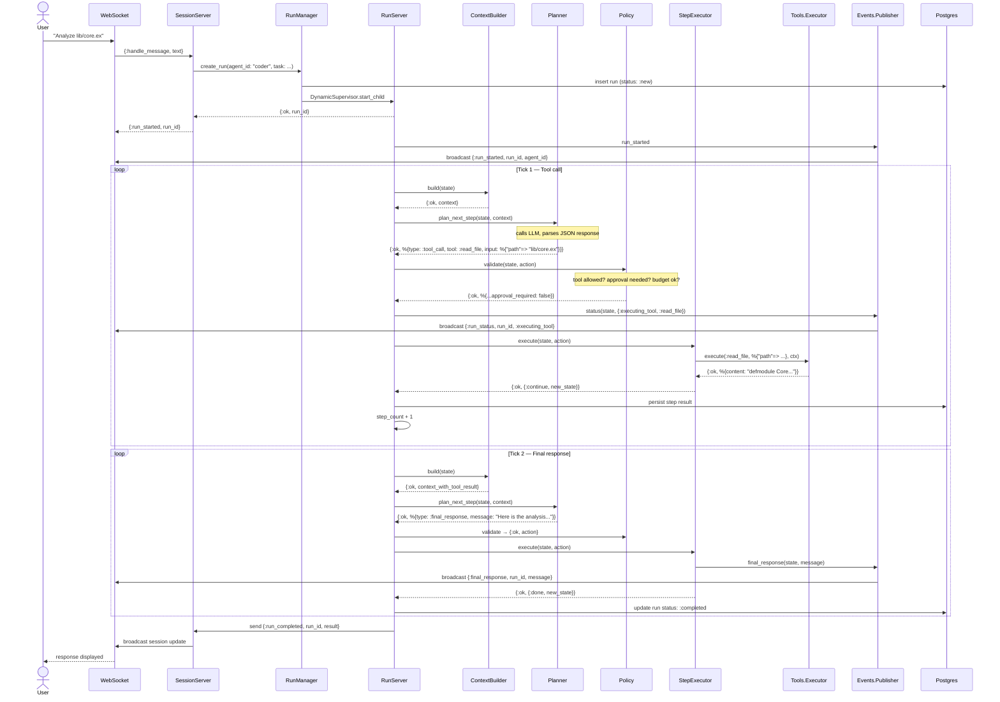

#### 8.3 Engine Function Call Graph

This shows the structural relationships between engine modules — which module calls which function. Complements D9 (control flow) with the module/boundary view.

**D11 — Engine Function Call Graph**

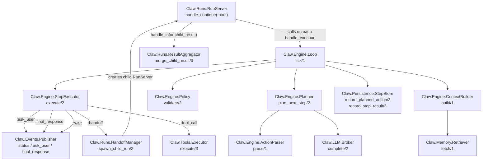

#### 8.4 RunServer Implementation

The `RunServer` is the heart of the runtime. Its `handle_continue/2` drives all execution:

```elixir
# handle_continue(:boot) is called:
# 1. After init (first tick)
# 2. After child result arrives
# 3. After approval decision arrives
# 4. After user reply arrives
def handle_continue(:boot, state) do
  case Loop.tick(state) do
    {:continue, new_state} ->
      # immediately re-tick (no blocking sleep)
      {:noreply, new_state, {:continue, :boot}}

    {:wait, new_state} ->
      # stop ticking; await an external message
      {:noreply, new_state}

    {:done, new_state} ->
      Publisher.run_completed(new_state)
      ChildCompletionHook.notify_parent_if_needed(new_state)
      {:stop, :normal, new_state}

    {:failed, new_state} ->
      Publisher.run_failed(new_state)
      ChildCompletionHook.notify_parent_if_needed(new_state)
      {:stop, :normal, new_state}
  end
end
```

Key design: `{:continue, :boot}` makes the GenServer re-enter `handle_continue` immediately, consuming all ticks without yielding to the mailbox. This is efficient for fast tool calls but care must be taken that long-running tool calls happen in separate processes (Task or Port) — not blocking the RunServer.

#### 8.5 Loop Invariants & Guards

These are checked at the top of `Loop.tick/1` before any LLM call:

```elixir
def tick(state) do
  cond do
    state.status in [:cancelled, :completed, :failed] ->
      {:done, state}

    state.step_count >= state.max_steps ->
      {:failed, %{state | status: :failed, last_error: :max_steps_exceeded}}

    state.budget.tool_calls <= 0 ->
      {:failed, %{state | status: :failed, last_error: :tool_budget_exceeded}}

    true ->
      do_tick(state)
  end
end
```

**Other invariants the loop must never violate:**
- Never call `Planner.plan_next_step/2` if status is a wait state (guards above prevent this)
- Never advance `step_count` for a `:wait` outcome (the step was not executed — only for `:continue`)
- Always call `StepStore.record_planned_action/3` BEFORE `StepExecutor.execute/2`
- Always call `StepStore.record_step_result/3` AFTER `StepExecutor.execute/2`, even on failure

#### 8.6 Implementation Checklist

- [ ] `Loop.tick/1` is a pure function (no side effects in the function itself; side effects happen in CB, PL, SE)
- [ ] `ContextBuilder.build/1` loads at most last 20 messages to avoid context overflow (TBD-13)
- [ ] `Planner.plan_next_step/2` always calls `LLM.Broker.complete/2` — never calls provider directly
- [ ] `Policy.validate/2` is called on EVERY action, including `:ask_user` and `:final_response` (they always pass, but the call is mandatory for auditability)
- [ ] `StepExecutor.execute/2` for tool calls launches tool work in a `Task` or worker process — never blocks RunServer
- [ ] `Events.Publisher` calls are `Phoenix.PubSub.broadcast` — fire-and-forget, never block the loop
- [ ] Max steps reached: status → `:failed` with `last_error: :max_steps_exceeded`, parent notified

---

### Chapter 9: Planner, Policy & Executor

> **Rationale.** The planner, policy, and executor are three distinct modules — not one. This separation (ADR-0009) means each can be tested in isolation, the policy can be swapped without touching the planner, and the executor can add new action types without the policy needing to understand their internals. The planner is the only module that calls the LLM — everything downstream is pure Elixir.

#### 9.1 Planner

`Claw.Engine.Planner.plan_next_step/2` has one job: ask the LLM broker what the next action is, and return a parsed, typed action struct.

**Prompt structure:**

```elixir
%{
  system: state.agent.system_prompt,
  developer: """
  You are controlling an autonomous agent runtime.
  Return exactly ONE action in strict JSON.
  Allowed actions: tool_call, handoff, ask_user, final_response, wait, noop.
  Never return more than one action per response.
  Never include reasoning or prose outside the JSON object.
  """,
  user: state.task,
  context: %{
    recent_messages: Enum.take(state.messages, -20),
    memory: retrieved_memory,
    results_so_far: state.results,
    scratchpad: state.scratchpad,
    available_tools: state.agent.tool_names,
    handoff_targets: state.agent.handoff_targets,
    step_count: state.step_count,
    max_steps: state.max_steps
  }
}
```

**Implementation notes:**
- The planner is stateless — all state comes from the `context` map
- On LLM error (network, rate limit), `plan_next_step` returns `{:error, reason}` — Loop handles the failure
- On parse error (invalid JSON), returns `{:error, {:parse_error, raw_response}}` — Loop fails the run
- The `reason` field in the JSON is advisory — it helps debugging but is not executed

#### 9.2 Action Types & JSON Contract

Exactly 6 action types are valid. Any other JSON is a parse error.

| Action | When the planner uses it | Engine response |
|---|---|---|
| `tool_call` | Agent needs to use a tool | Policy validates, executor runs tool |
| `handoff` | Task needs a specialist | Policy validates, executor spawns child run |
| `ask_user` | Agent needs human input | Executor pauses run, emits question |
| `final_response` | Agent is done | Executor emits response, run → `:completed` |
| `wait` | Agent needs to pause | Executor emits wait status, run → `:waiting` |
| `noop` | Agent has nothing to do | Executor does nothing, step incremented |

**JSON shapes (strict, all fields required unless noted):**

```json
// tool_call
{"action": "tool_call", "tool": "read_file", "input": {"path": "lib/core.ex"}, "reason": "..."}

// handoff
{"action": "handoff", "agent_id": "reviewer", "task": "Review the architecture proposal", "reason": "..."}

// ask_user
{"action": "ask_user", "question": "Which repository path should I analyze?"}

// final_response
{"action": "final_response", "message": "Here is the analysis..."}

// wait
{"action": "wait", "reason": "Waiting for external data"}

// noop
{"action": "noop", "reason": "No action needed at this step"}
```

#### 9.3 Action Parser

`Claw.Engine.ActionParser.parse/1` translates the LLM's JSON map into typed action structs with atoms as types. It is pattern-matched — any shape not listed returns `{:error, {:invalid_action, raw}}`.

```elixir
defmodule Claw.Engine.ActionParser do
  def parse(%{"action" => "tool_call", "tool" => tool, "input" => input} = raw) do
    {:ok, %{type: :tool_call, tool: String.to_existing_atom(tool), input: input, raw: raw}}
  end
  def parse(%{"action" => "handoff", "agent_id" => id, "task" => task} = raw) do
    {:ok, %{type: :handoff, agent_id: id, task: task, raw: raw}}
  end
  def parse(%{"action" => "ask_user", "question" => q} = raw) do
    {:ok, %{type: :ask_user, question: q, raw: raw}}
  end
  def parse(%{"action" => "final_response", "message" => m} = raw) do
    {:ok, %{type: :final_response, message: m, raw: raw}}
  end
  def parse(%{"action" => "wait"} = raw) do
    {:ok, %{type: :wait, raw: raw}}
  end
  def parse(%{"action" => "noop"} = raw) do
    {:ok, %{type: :noop, raw: raw}}
  end
  def parse(raw), do: {:error, {:invalid_action, raw}}
end
```

**Security note:** Use `String.to_existing_atom/1` (not `String.to_atom/1`) for tool names to prevent atom table exhaustion from malicious LLM output.

#### 9.4 Policy Engine Decision Tree

`Claw.Engine.Policy.validate/2` is the gatekeeper. It runs synchronously in the tick loop and must be fast (no DB calls).

**D12 — Policy Engine Decision Tree**

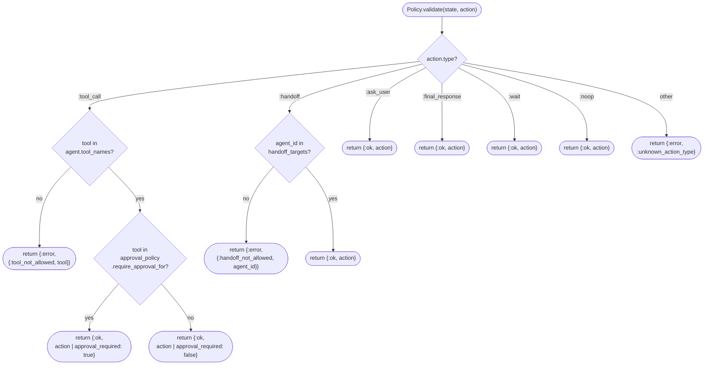

**Future policy checks to add (not in v1):**
- Budget check: `state.budget.tool_calls <= 0 → deny`
- Path scope check: `file path within allowed workspace root`
- Depth limit: `length(state.child_runs) >= max_depth → deny handoff`

#### 9.5 Action Parser Decision Tree

**D13 — Action Parser Decision Tree**

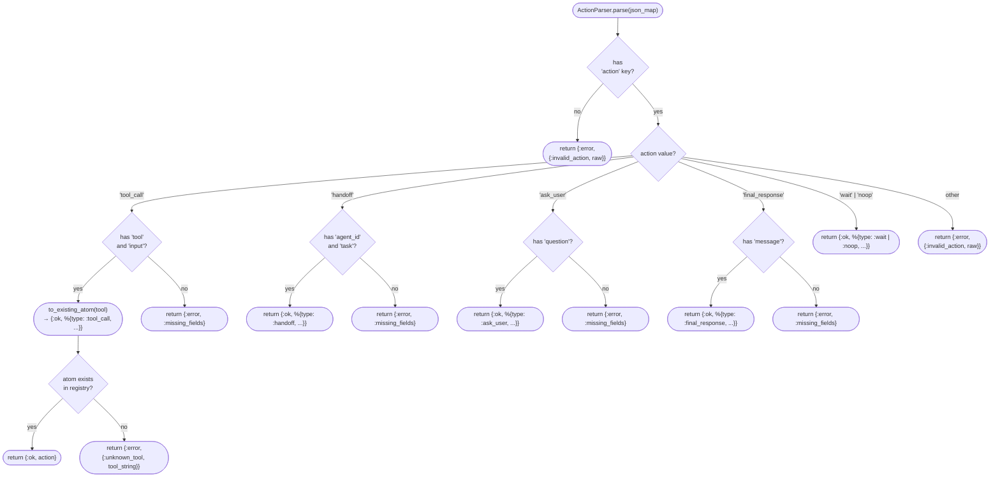

#### 9.6 Step Executor

`Claw.Engine.StepExecutor.execute/2` dispatches on the action type. Each branch is a separate function clause.

| Action type | Side effects | Returns |
|---|---|---|
| `:tool_call` (approval_required: true) | Emits approval_requested event | `{:ok, {:wait, new_state}}` |
| `:tool_call` (approval_required: false) | Runs tool via Executor, stores result | `{:ok, {:continue, new_state}}` or `{:ok, {:failed, new_state}}` |
| `:handoff` | Spawns child run via HandoffManager | `{:ok, {:wait, new_state}}` |
| `:ask_user` | Emits ask_user event | `{:ok, {:wait, new_state}}` |
| `:final_response` | Emits final_response event | `{:ok, {:done, new_state}}` |
| `:wait` | Emits wait status | `{:ok, {:wait, new_state}}` |
| `:noop` | No side effects | `{:ok, {:continue, new_state}}` |

**Critical:** Tool execution must NOT block the RunServer. Long-running tools are started in a `Task` or via the ToolWorker sandbox. The RunServer stays responsive to messages (cancel, approval) while the tool runs.

#### 9.7 Implementation Checklist

- [ ] `ActionParser` uses `String.to_existing_atom/1` for tool names — all valid tool atoms must be loaded at startup
- [ ] `Policy.validate/2` has no DB calls — it operates on `state.agent.tool_names` and `state.agent.approval_policy` only
- [ ] `Policy.validate/2` is called before EVERY `StepExecutor.execute/2` — no exceptions
- [ ] `StepExecutor` for `:tool_call` (no approval): runs `ToolExecutor.execute` in a Task, awaits with timeout (TBD-18)
- [ ] `StepExecutor` for `:handoff`: calls `HandoffManager.spawn_child_run/2` which calls `RunManager.create_run/1`
- [ ] All StepExecutor branches call `Publisher.*` for event emission
- [ ] Planner prompt includes `step_count` and `max_steps` so LLM can self-regulate

---

### Chapter 9A: Approvals, Failures & Cancellation

> **Rationale.** Approvals are a first-class safety mechanism — not an afterthought. They are persisted to DB so that the system can recover from a crash while waiting for approval (ADR-0016). Failures are typed and explicit (not just exceptions) so the engine can distinguish recoverable from fatal failures. Cancellation propagates to child runs to prevent orphaned processes.

#### 9A.1 Approval Flow Sequence

When `Policy.validate/2` returns `{:ok, action | approval_required: true}`, the `StepExecutor` emits an approval request event and transitions the run to `:waiting_approval`.

**D14 — Approval Flow Sequence**

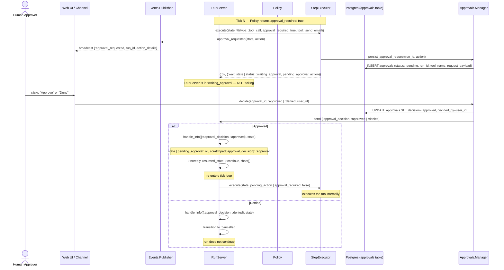

**Sub-state of `:waiting_approval`:**

```
:waiting_approval
  ├─ :pending     (no decision yet)
  ├─ :approved    (decision received: approved — internal, runs one tick)
  └─ :denied      (decision received: denied — transitions to :cancelled)
```

**Approval persistence invariant:** The `approvals` table row must be written BEFORE the run transitions to `:waiting_approval`. If the RunServer crashes while waiting, on restart it reads its `pending_approval` from the DB row and re-emits the event to the UI.

#### 9A.2 Failure Handling

**Types of failures:**

| Failure type | Origin | RunServer response |
|---|---|---|
| `{:error, {:tool_not_allowed, tool}}` | Policy | `:failed` |
| `{:error, {:handoff_not_allowed, id}}` | Policy | `:failed` |
| `{:error, :unknown_action_type}` | Policy | `:failed` |
| `{:error, {:invalid_action, raw}}` | ActionParser | `:failed` |
| `{:error, reason}` from tool | StepExecutor | `:failed` (or `:continue` with error result) |
| `:max_steps_exceeded` | Loop guard | `:failed` |
| `:tool_budget_exceeded` | Loop guard | `:failed` |
| child run failure | ChildCompletionHook | parent decides (see below) |

**Parent behavior when a child run fails:**

```elixir
# In ResultAggregator or a dedicated FailureHandler:
case child_failure_type do
  :tool_timeout   -> maybe_retry_child(state, failed_run_id)
  :budget_exceeded -> continue_without_child(state, failed_run_id)
  :invalid_output  -> route_to_fallback_agent(state)
  :forbidden_action -> stop_and_ask_user(state)
  :model_error    -> maybe_retry_child(state, failed_run_id)
end
```

For v1: **stop and ask user** is the safest default for any child failure. Retry and fallback are v2 features.

**Failed run state:**

```elixir
%RunState{
  status: :failed,
  last_error: :max_steps_exceeded | {:tool_not_allowed, :send_email} | ...
}
```

`last_error` is persisted to the `runs` table so it can be surfaced in the UI and reviewed.

#### 9A.3 Cancellation

Cancellation is triggered by `RunManager.cancel_run(run_id)`:

```elixir
# In RunServer:
def handle_call(:cancel, _from, state) do
  new_state = %{state | status: :cancelled}
  # Cancel any pending child runs
  Enum.each(state.child_runs, &RunManager.cancel_run/1)
  Publisher.run_cancelled(new_state)
  {:reply, :ok, new_state, {:stop, :normal, new_state}}
end
```

**Cancellation propagates to children.** An orphaned child run (parent cancelled) without cancellation would keep consuming tokens and tool budget with no one to receive its result.

**Cancellation during approval wait:** The run is in `:waiting_approval`. Cancel via `handle_call(:cancel)` updates the DB approval row to `decision: :cancelled_by_user`, then stops the process.

#### 9A.4 Implementation Checklist

- [ ] `Approvals.Manager.persist_approval_request/2` writes to DB **before** StepExecutor returns `{:wait, ...}`
- [ ] RunServer `handle_info({:approval_decision, ...})` re-triggers `{:continue, :boot}` on approval
- [ ] RunServer `handle_info({:approval_decision, :denied})` transitions to `:cancelled`, not `:failed`
- [ ] On RunServer crash during `:waiting_approval`: init/1 reads `pending_approval` from DB, re-emits event
- [ ] Child run cancellation is best-effort (log error if child not found in registry, continue)
- [ ] `Publisher.run_failed/1` includes `last_error` in the broadcast payload for UI display
- [ ] All failure paths write to `runs.last_error` and `runs.status` before process exits

---

## Part 4 — Capabilities

### Chapter 10: Memory Architecture

> **Rationale.** A 4-layer memory model (ADR-0010) balances access speed against persistence cost. Working memory is free (in-process). Episodic memory captures "what happened" without embedding overhead. Semantic memory enables long-range recall but requires embedding calls. Structured memory is the fastest for known-key lookups. Not everything is worth storing — the write policy filters aggressively to avoid memory bloat.

#### 10.1 Four-Layer Memory Stack

**D15 — Four-Layer Memory Stack**

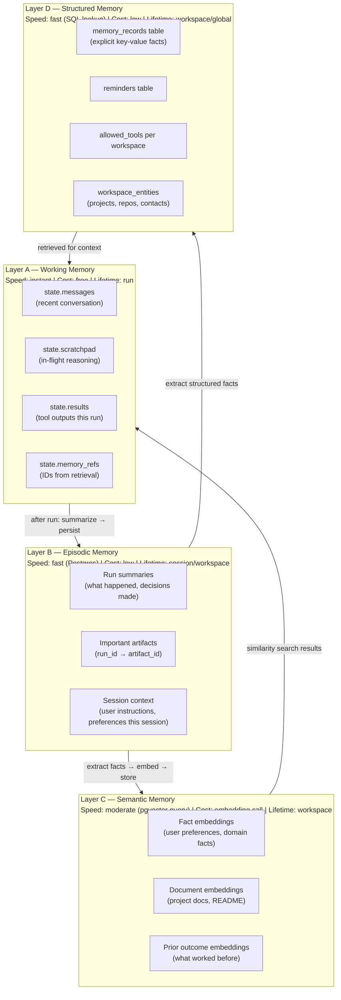

#### 10.2 Memory Scope Hierarchy

Memory scopes define **visibility boundaries** — which runs/agents can read and write which memory. See shared memory discussion in Ch 16 (Handoffs).

**D16 — Memory Scope Hierarchy**

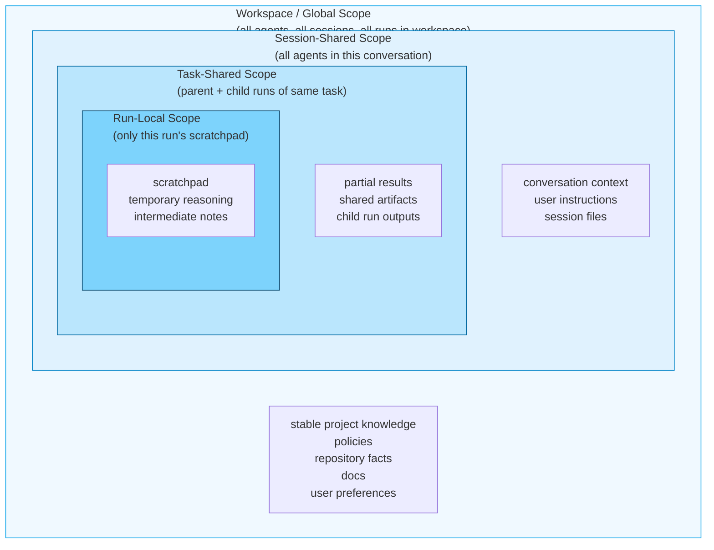

**Scope access rules:**

| Scope | Agent can read | Agent can write | Cleared when |
|---|---|---|---|
| Run-local | Only this run | Only this run | Run ends |
| Task-shared | Parent + children of task | Parent + children | Task completes |
| Session-shared | All agents in session | With explicit scope declaration | Session ends |
| Workspace/global | All agents in workspace | With workspace write permission | Never (explicit delete) |

Memory scope promotion (e.g., run-local → task-shared) requires an explicit action in the agent definition. Automatic promotion is not supported in v1. See TBD-23.

#### 10.3 Memory Write Policy Activity

Writing to memory is **always asynchronous and post-run**. It never happens inside the tick loop. The write policy filters aggressively — only high-value memories are committed.

**D17 — Memory Write Policy Activity**

```mermaid
flowchart TD
  Start(["Run completes or reaches checkpoint"])

  Start --> HasOutput{Any meaningful\noutput / results?}
  HasOutput -->|"no"| Skip(["Skip — nothing to store"])

  HasOutput -->|"yes"| Summarize["Memory.Summarizer.summarize(run_state)\n→ %{summary, key_decisions, artifacts}"]

  Summarize --> Extract["Memory.Extractor.extract_facts(summary)\n→ [%{fact, type, confidence}]"]

  Extract --> ScoreFacts["Score each candidate fact:\n• relevance to workspace\n• novelty (not already in memory)\n• confidence (0.0–1.0)\n• decay_rate (how soon it expires)"]

  ScoreFacts --> FilterThreshold{confidence >= threshold\n(e.g. 0.6)?}

  FilterThreshold -->|"no"| Discard["Discard low-confidence fact"]

  FilterThreshold -->|"yes"| RouteFact{fact type?}

  RouteFact -->|"structured fact"| WriteStructured["Memory.Writer.write_structured/1\n→ INSERT INTO memory_records"]

  RouteFact -->|"semantic fact"| Embed["LLM.Broker.embeddings(fact_text)\n→ vector"]
  Embed --> WriteVector["Memory.Writer.write_semantic/2\n→ INSERT INTO memory_records\n  (content + vector in pgvector)"]

  RouteFact -->|"episodic summary"| WriteEpisodic["Memory.Writer.write_episodic/1\n→ INSERT INTO memory_records\n  (type: :episode, run_id, summary)"]

  WriteStructured --> Done(["Memory write complete"])
  WriteVector --> Done
  WriteEpisodic --> Done
  Discard --> Done
```

#### 10.4 Memory Retrieval Sequence

Retrieval happens inside `ContextBuilder.build/1` at the start of each tick. It uses a multi-tier lookup: fast caches first, then structured DB, then vector similarity.

**D18 — Memory Retrieval Sequence**

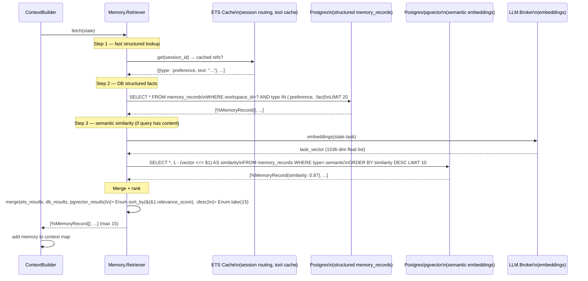

**Retrieval budget:** Maximum 15 memory records per tick to avoid context overflow (TBD-13). Ranked by recency + similarity score.

#### 10.5 pgvector Integration

**Schema setup:**

```sql
-- Enable pgvector extension
CREATE EXTENSION IF NOT EXISTS vector;

-- Add vector column to memory_records (after table creation)
ALTER TABLE memory_records ADD COLUMN embedding vector(1536);  -- TBD-21: dimensions

-- Index for ANN search (HNSW for speed, IVFFlat for low memory)
CREATE INDEX memory_embedding_idx ON memory_records
USING hnsw (embedding vector_cosine_ops)
WITH (m = 16, ef_construction = 64);
```

**Ecto schema:**

```elixir
defmodule Claw.Persistence.Schemas.MemoryRecord do
  use Ecto.Schema

  schema "memory_records" do
    field :workspace_id, :string
    field :session_id,   :string
    field :run_id,       :string
    field :type,         Ecto.Enum, values: [:preference, :fact, :episode, :semantic]
    field :content,      :string
    field :embedding,    Pgvector.Ecto.Vector  # from pgvector Elixir library
    field :metadata,     :map
    field :confidence,   :float
    timestamps()
  end
end
```

#### 10.6 ETS Cache Patterns

ETS tables owned by `Claw.CacheSupervisor` children:

| Table name | Key | Value | Purpose |
|---|---|---|---|
| `:claw_tool_registry` | `tool_name` (atom) | module | Avoids GenServer call for tool lookup |
| `:claw_session_routing` | `session_id` | `pid` | Fast channel → session routing without Registry |
| `:claw_model_metadata` | `provider_id` | `%{max_tokens, pricing}` | Model config without DB hit |
| `:claw_memory_hot` | `session_id` | `[recent_memory_records]` | Hot memory cache, refreshed post-run |

ETS tables use `:named_table, :set, read_concurrency: true` for all read-heavy caches.

#### 10.7 Implementation Checklist

- [ ] `Claw.Memory.Retriever.fetch/1` called in `ContextBuilder.build/1`, results added to context
- [ ] Memory write runs as a post-run `Oban` job — never blocking the tick loop
- [ ] `Pgvector.Ecto.Vector` type used for `embedding` column (pgvector Elixir library)
- [ ] HNSW index created on `memory_records.embedding` (see §10.5)
- [ ] `String.to_existing_atom/1` used when converting `type` strings to atoms
- [ ] ETS tables owned by named GenServers under `CacheSupervisor` (not raw `:ets.new`)
- [ ] `Memory.Summarizer` uses `LLM.Broker.complete/2` — same broker, different system prompt
- [ ] TBD-21: embedding dimension (1536) must be fixed before first migration

---

### Chapter 11: Tool System

> **Rationale.** Tools are Elixir modules implementing a behaviour (ADR-0012). This gives us compile-time callback verification, hot code reloading, and no serialization overhead for calling built-in tools. The Registry (GenServer) is the single source of truth for available tools — no hardcoded lists in the planner or policy. Dangerous tools run in external processes (ADR-0013) so their crash cannot affect the main node.

#### 11.1 Tool Definition Behavior

Every tool implements `Claw.Tools.ToolDefinition`:

```elixir
defmodule Claw.Tools.ToolDefinition do
  @callback spec() :: %{
    name:         atom(),
    description:  String.t(),
    input_schema: map(),        # JSON Schema map, used by LLM and validator
    output_schema: map(),
    permissions:  [atom()],     # [:read_file, :write_file, :network, :shell, ...]
    timeout_ms:   pos_integer(),
    idempotent:   boolean()
  }

  @callback run(input :: map(), ctx :: %{
    run_id:       String.t(),
    session_id:   String.t(),
    agent_id:     String.t(),
    memory_scope: atom(),
    capability_token: map()     # scoped credential (TBD-03)
  }) :: {:ok, map()} | {:error, map()}
end
```

The `spec/0` return value is used for:
1. Building the LLM tool-calling schema (input_schema → function definition for OpenAI/Anthropic)
2. Input validation before execution (TBD-17)
3. Capability token scoping (permissions list)
4. UI tool catalog display

#### 11.2 Tool Category Tree

**D19 — Tool Category Tree**

```mermaid
graph TD
  Root["Tools\n(all implement ToolDefinition behaviour)"]

  Root --> Pure["Pure Tools\n(no side effects, fully safe)"]
  Root --> Read["Read Tools\n(read external state, no writes)"]
  Root --> Write["Write Tools\n(cause side effects, reversible)"]
  Root --> Dangerous["Dangerous Tools\n(irreversible or high-risk\n→ require approval + sandbox)"]

  Pure --> P1["calculator"]
  Pure --> P2["text_parser"]
  Pure --> P3["summarizer"]
  Pure --> P4["file_transform\n(format conversion)"]

  Read --> R1["web_fetch\n(read URL)"]
  Read --> R2["file_read\n(workspace files)"]
  Read --> R3["search_memory"]
  Read --> R4["calendar_read"]
  Read --> R5["db_query\n(SELECT only)"]

  Write --> W1["file_write\n(workspace files)"]
  Write --> W2["calendar_create"]
  Write --> W3["email_draft\n(saved, not sent)"]
  Write --> W4["reminder_create"]
  Write --> W5["notes_write"]

  Dangerous --> D1["email_send\n(approval required)"]
  Dangerous --> D2["shell_command\n(sandboxed + allowlist)"]
  Dangerous --> D3["browser_automation\n(sandboxed)"]
  Dangerous --> D4["file_delete\n(approval required)"]
  Dangerous --> D5["secret_access\n(approval + audit)"]

  style Pure fill:#dcfce7
  style Read fill:#dbeafe
  style Write fill:#fef9c3
  style Dangerous fill:#fee2e2
```

**Category determines:**
- Approval policy: Dangerous tools always require approval; others may per agent policy
- Sandbox: Dangerous tools always run in isolated process; others run in RunServer task
- Audit: All tools audited; Dangerous tools additionally log input_hash and output_hash

#### 11.3 Tool Execution Sequence with Approval

**D20 — Tool Execution Sequence with Approval**

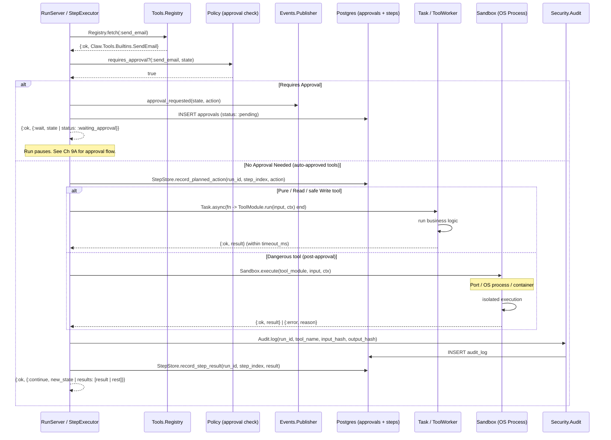

#### 11.4 Safety Model

For each tool, define all of the following at definition time (in `spec/0`):

| Safety attribute | Location | Example |
|---|---|---|
| `permissions` | `spec/0` | `[:network, :read_file]` |
| `timeout_ms` | `spec/0` | `5_000` (5 seconds) |
| `idempotent` | `spec/0` | `false` (for send_email) |
| Approval required | `AgentDefinition.approval_policy` | `require_approval_for: [:send_email]` |
| Sandbox type | `Sandbox.strategy/1` lookup | `:os_process` for shell, `:in_task` for read_file |
| Audit level | `Security.Audit.policy/1` lookup | `:full` (hash input+output) vs `:minimal` (log only) |

**Capability tokens in tool context:**

```elixir
# ctx passed to every tool.run/2
%{
  run_id: "run_001",
  agent_id: "coder",
  capability_token: %{
    run_id: "run_001",
    tool_name: :write_file,
    scope: %{allowed_paths: ["/workspace/lib/"]},
    exp: ~U[2024-01-01 00:05:00Z],
    nonce: "abc123"
  }
}
```

The tool is responsible for checking `capability_token.scope` before acting. For `write_file`, this means verifying the requested path is within `allowed_paths`. See TBD-03 for token format decision.

#### 11.5 Sandbox Architecture (see TBD-16)

For dangerous tools, execution happens in an isolated process, not the RunServer:

```
RunServer
  └─ Sandbox.execute/3
       └─ Port.open / spawn_link (OS subprocess) OR
          DynamicSupervisor.start_child (ToolWorker GenServer)
            └─ executes ToolModule.run/2
            └─ results sent back as message
```

The `ToolWorkerSupervisor` gives us:
- Per-tool-call crash isolation (crash does not kill RunServer)
- Timeout enforcement (supervisor kills worker after `timeout_ms`)
- Resource limits (can set OS-level limits on the subprocess)

TBD-16 tracks the decision on which sandbox mechanism to use for which tool categories.

#### 11.6 Implementation Checklist

- [ ] `Claw.Tools.Registry` pre-loads all built-in tool modules on startup
- [ ] `spec/0` `input_schema` is valid JSON Schema (used to build OpenAI/Anthropic function definitions)
- [ ] `Tools.Executor.execute/3` calls `Schema.validate_input/2` before running the tool (TBD-17)
- [ ] Tool timeouts enforced via `Task.async` + `Task.await(task, timeout_ms)`
- [ ] `Security.Audit.log/4` called after every tool execution (success or failure)
- [ ] `String.to_existing_atom/1` used when looking up tool name from planner JSON
- [ ] Dangerous tools: all paths go through `Sandbox` — never inline in RunServer
- [ ] v1 built-in tools: `read_file`, `write_file`, `web_fetch`, `shell_command` (allowlist), `search_memory`, `reminder_create`, `calendar_read`, `email_draft`

---

### Chapter 12: LLM Broker & Providers

> **Rationale.** The entire platform calls `LLM.Broker.complete/2` — never a provider module directly. This means swapping providers, adding failover, or running evals against different models requires no changes to the engine. The `Provider` behaviour ensures every implementation handles the same contract. See ADR-0011.

#### 12.1 Provider Class Diagram

**D21 — LLM Provider Behaviour + Implementations**

```mermaid
classDiagram
  class Provider {
    <<behaviour>>
    +chat(request: map) {:ok, map} | {:error, term}
    +embeddings(request: map) {:ok, map} | {:error, term}
    +supports_tools() boolean
    +supports_vision() boolean
    +supports_json() boolean
    +count_tokens(text: str) {:ok, int} | {:error, term}
  }

  class Broker {
    +complete(request: map, opts: keyword) {:ok, map} | {:error, term}
    +embed(text: str, opts: keyword) {:ok, list} | {:error, term}
    -select_provider(request, opts) module
    -failover(providers: list, request: map) {:ok, map} | {:error, term}
  }

  class OpenAI {
    +base_url: "https://api.openai.com/v1"
    +models: ["gpt-4o", "gpt-4o-mini", ...]
    +chat(request) {:ok, map} | {:error, term}
    +embeddings(request) {:ok, map} | {:error, term}
    +supports_tools() true
    +supports_vision() true
    +supports_json() true
  }

  class Anthropic {
    +base_url: "https://api.anthropic.com/v1"
    +models: ["claude-opus-4-6", "claude-sonnet-4-6", ...]
    +chat(request) {:ok, map} | {:error, term}
    +embeddings(request) {:error, :not_supported}
    +supports_tools() true
    +supports_vision() true
    +supports_json() true
  }

  class Ollama {
    +base_url: "http://localhost:11434"
    +models: ["llama3", "mistral", ...]
    +chat(request) {:ok, map} | {:error, term}
    +embeddings(request) {:ok, map} | {:error, term}
    +supports_tools() false
    +supports_vision() false
    +supports_json() false
  }

  Provider <|.. OpenAI : implements
  Provider <|.. Anthropic : implements
  Provider <|.. Ollama : implements
  Broker --> Provider : dispatches to
```

#### 12.2 LLM Failover Sequence

**D22 — LLM Failover Sequence**

```mermaid
sequenceDiagram
  participant PL as Planner
  participant BK as LLM.Broker
  participant OAI as LLM.Providers.OpenAI
  participant ANT as LLM.Providers.Anthropic
  participant TEL as Telemetry

  PL->>BK: complete(request, opts: [provider: :auto])

  BK->>BK: select_provider(request)\n→ :openai (primary)

  BK->>OAI: chat(normalized_request)
  TEL->>TEL: :telemetry.span([:claw, :llm, :request], ...)

  alt OpenAI succeeds
    OAI-->>BK: {:ok, response}
    BK-->>PL: {:ok, normalized_response}

  else OpenAI rate limit (429)
    OAI-->>BK: {:error, :rate_limit}
    TEL->>TEL: emit [:claw, :llm, :error] event
    BK->>BK: failover → next provider: :anthropic

    BK->>ANT: chat(normalized_request)
    alt Anthropic succeeds
      ANT-->>BK: {:ok, response}
      BK-->>PL: {:ok, normalized_response}
    else Anthropic also fails
      ANT-->>BK: {:error, reason}
      BK-->>PL: {:error, :all_providers_failed}
    end

  else OpenAI network error (timeout)
    OAI-->>BK: {:error, :timeout}
    BK->>BK: retry with same provider (up to 3 times)\nwith exponential backoff
    BK->>OAI: chat(request) # retry
    OAI-->>BK: {:ok, response}
    BK-->>PL: {:ok, normalized_response}
  end
```

#### 12.3 Broker Responsibilities

The Broker handles all concerns external to a single provider call:

| Responsibility | Implementation |
|---|---|
| **Provider selection** | Per-workspace config (`workspace.preferred_provider`) or `opts[:provider]` |
| **Failover** | Ordered provider list; try next on `{:error, :rate_limit | :server_error}` |
| **Retry** | Exponential backoff for `:timeout` and `:connection_refused` |
| **Request normalization** | Translates CLAW's universal format to each provider's schema |
| **Response normalization** | Translates each provider's response to CLAW's universal format |
| **Token counting** | Estimates tokens before sending (for budget check — TBD-13) |
| **Cost tracking** | Records `input_tokens`, `output_tokens` per call (TBD-15) |
| **Tools schema injection** | Converts `AgentDefinition.tool_names` → provider function-calling schema |

**Universal request format:**

```elixir
%{
  model:       "gpt-4o",          # or nil for broker to choose
  messages:    [%{role: :user, content: "..."}],
  tools:       [%{name: :read_file, description: "...", input_schema: %{...}}],
  temperature: 0.2,
  max_tokens:  4096,
  response_format: :json          # for planner calls
}
```

#### 12.4 Provider Implementations (see TBD-12)

TBD-12 tracks the full provider adapter specifications. Interim notes:

- **OpenAI**: Use `Finch`/`Req` for HTTP. SSE streaming for chat completions. Tool-calling via `functions`/`tools` field. Embeddings via `/v1/embeddings`.
- **Anthropic**: Messages API `/v1/messages`. Tool-calling via `tools` field. Streaming via SSE. No embeddings endpoint — route embedding requests to OpenAI or Ollama.
- **Ollama**: `/api/generate` or `/api/chat`. No SSE — poll or use chunked response. No native tool-calling — inject tool schema into system prompt (workaround until native support).

#### 12.5 Implementation Checklist

- [ ] `LLM.Broker` is the ONLY module that calls provider modules — planner uses broker
- [ ] Provider selection via `Application.get_env(:claw, :default_provider)` with per-workspace override
- [ ] `Finch` connection pool configured in `Application.start/2` with appropriate pool sizes per provider
- [ ] Request normalization tested with unit tests (no LLM calls needed)
- [ ] Failover tested with mock providers that return controlled errors
- [ ] Token counting function exists before first integration (used for budget pre-check — TBD-06)

---

### Chapter 13: Channels & Event Contract

> **Rationale.** Channel adapters normalize all inbound events to `%InboundEvent{}` and all outbound events from `%OutboundEvent{}`. This abstraction (ADR-0014) prevents channel-specific logic from leaking into session or agent code. Adding a new channel (e.g., Discord) requires only a new adapter module — the engine never changes.

#### 13.1 Channel Event Fanout

**D23 — Channel Event Fanout**

```mermaid
graph LR
  subgraph Inbound["Inbound (many → one)"]
    Slack["Slack\nWebhook POST"]
    Telegram["Telegram\nWebhook POST"]
    WebWS["Web Browser\nWebSocket"]
    CLI["CLI\nSTDIO"]
  end

  Normalize["Channel Adapter\nnormalize_inbound/1\n→ %InboundEvent{}"]

  GW["Gateway.Dispatcher\nroutes to SessionServer"]

  SS["SessionServer\n(one per session)"]

  subgraph Outbound["Outbound (one → many)"]
    OS["Slack\nPOST /api/chat.postMessage"]
    OT["Telegram\nPOST /sendMessage"]
    OW["Web Browser\nWebSocket push"]
    OC["CLI\nSTDIO write"]
  end

  NormalizeOut["Channel Adapter\nsend_outbound/2\n(consumes %OutboundEvent{})"]

  PUB["Events.Publisher\nPubSub broadcast"]

  Slack -->|webhook| Normalize
  Telegram -->|webhook| Normalize
  WebWS -->|ws frame| Normalize
  CLI -->|stdin| Normalize

  Normalize --> GW
  GW --> SS

  SS --> PUB
  PUB -->|"broadcast 'session:sess_id'"| NormalizeOut

  NormalizeOut --> OS
  NormalizeOut --> OT
  NormalizeOut --> OW
  NormalizeOut --> OC
```

#### 13.2 Channel Adapter Sequence

**D24 — Channel Adapter Sequence (Slack example)**

```mermaid
sequenceDiagram
  participant Slack as Slack Server
  participant GW as Phoenix Router\n(Slack webhook endpoint)
  participant SA as Channels.Slack\n(adapter)
  participant DI as Gateway.Dispatcher
  participant SS as SessionServer
  participant RS as RunServer
  participant PUB as Events.Publisher

  Slack->>GW: POST /webhooks/slack\n{event: {type: message, text: "analyze repo"}}

  GW->>SA: Channels.Slack.handle_webhook(conn, payload)
  SA->>SA: verify_signature(payload, headers)
  SA->>SA: normalize_inbound(payload)\n→ %InboundEvent{source: :slack, text: "analyze repo", ...}
  SA->>DI: Dispatcher.dispatch(%InboundEvent{})

  DI->>SS: find_or_start_session(channel_account_id)
  SS-->>DI: {:ok, session_pid}
  DI->>SS: GenServer.cast(session_pid, {:handle_message, event})

  SS->>RS: RunManager.create_run(...)
  RS-->>SS: {:ok, run_id}

  loop Engine executes
    RS->>PUB: status updates
    PUB->>PUB: PubSub.broadcast("session:sess_id", event)
  end

  RS->>PUB: final_response(state, message)
  PUB->>SS: receives {:final_response, run_id, message}
  SS->>SS: build %OutboundEvent{target: :slack, ...}
  SS->>SA: Channels.Slack.send_outbound(%OutboundEvent{})
  SA->>Slack: POST https://slack.com/api/chat.postMessage\n{channel: ..., text: ...}
  Slack-->>SA: {:ok, %{ok: true}}

  Note over SA,GW: Idempotency: deduplicate on event.message_id (TBD-19)
```

#### 13.3 InboundEvent Schema

```elixir
%Claw.Channels.InboundEvent{
  source:                    :web | :slack | :telegram | :cli,
  channel_account_id:        String.t(),   # Slack channel ID, Telegram chat_id, etc.
  user_external_id:          String.t(),   # Slack user_id, Telegram user.id, etc.
  conversation_external_id:  String.t(),   # Thread/conversation ID for reply threading
  message_id:                String.t(),   # For idempotency (TBD-19)
  text:                      String.t(),
  attachments:               [map()],      # files, images, audio
  timestamp:                 DateTime.t()
}
```

#### 13.4 OutboundEvent Schema

```elixir
%Claw.Channels.OutboundEvent{
  target:       :web | :slack | :telegram | :cli,
  session_id:   String.t(),
  blocks:       [map()],     # Rich formatting blocks (Slack Block Kit, Telegram entities, etc.)
  text:         String.t(),  # Plain text fallback
  attachments:  [map()],     # Generated files, images
  typing:       boolean()    # Emit typing indicator before main response
}
```

**Adapter normalization responsibility:**
- `normalize_inbound/1` maps channel-specific payload → `%InboundEvent{}`
- `send_outbound/2` maps `%OutboundEvent{}` → channel-specific API call
- Adapters handle idempotency (message_id deduplication) and retry for outbound delivery (TBD-19, TBD-20)

#### 13.5 Implementation Checklist

- [ ] `Claw.Channels.Adapter` behaviour with `normalize_inbound/1` and `send_outbound/2` callbacks
- [ ] Slack adapter: verify `X-Slack-Signature` HMAC on every webhook (security requirement)
- [ ] Telegram adapter: validate `token` in webhook URL path
- [ ] Web adapter: Phoenix Channel `join/3` creates/resumes session
- [ ] CLI adapter: wraps STDIO in a GenServer, converts lines → InboundEvent
- [ ] Outbound delivery: Oban job for at-least-once delivery with retry (TBD-20)
- [ ] Message deduplication: check `message_id` against recent seen-IDs in ETS before processing (TBD-19)

---

### Chapter 14: Skills & Plugin Architecture

Skills allow users and operators to extend CLAW's behaviour without modifying core code. Two layers address different extension needs.

#### 14.1 Two-Layer Model

| Layer | Who creates | How stored | Restart required? |
|---|---|---|---|
| Declarative Skills | Users, operators | YAML / DB | No — hot-reloaded |
| Code Plugins | Developers | Elixir modules | Yes — compile + restart |

#### 14.2 Layer 1 — Declarative Skills (YAML/DB)

A skill is a bundle of: system_prompt additions + tool selections + policy overrides + triggers.

```yaml
name: calendar_assistant
description: "Helps manage calendars carefully"
tools:
  - calendar.read
  - calendar.create
policies:
  require_confirmation_for:
    - calendar.create
system_instructions: |
  You help manage calendars carefully.
  Always confirm before creating or modifying events.
  Prefer read-only actions unless explicitly asked to create.
triggers:
  - "schedule"
  - "meeting"
  - "calendar"
```

**How skills activate:**
1. User message matches one or more `triggers` (keyword or semantic match)
2. `Gateway.Dispatcher` selects the matching skill
3. `AgentDefinition` for the run is augmented with skill's `tools` and `system_instructions`
4. Policy is updated with skill's `require_confirmation_for`
5. Run proceeds with the augmented definition

**Storage:** DB-backed (`skills` table) for user-editable skills; YAML files for operator-defined presets loaded at startup.

#### 14.3 Layer 2 — Code Plugins (Elixir Behaviours)

For deeper integrations that YAML cannot express:

```elixir
# Custom channel adapter
defmodule MyApp.Channels.Discord do
  @behaviour Claw.Channels.Adapter
  def normalize_inbound(payload), do: ...
  def send_outbound(event), do: ...
end

# Custom retriever (e.g., search a proprietary knowledge base)
defmodule MyApp.Memory.EnterpriseRetriever do
  @behaviour Claw.Memory.RetrieverBehaviour
  def fetch(state), do: ...
end

# Custom tool (e.g., Jira integration)
defmodule MyApp.Tools.Jira do
  @behaviour Claw.Tools.ToolDefinition
  def spec(), do: %{name: :jira_create_issue, ...}
  def run(input, ctx), do: ...
end
```

Code plugins are registered at startup by including them in `Claw.Tools.Registry.init/1` or `Claw.Channels.Adapter.registry`.

#### 14.4 Implementation Checklist

- [ ] `skills` DB table: `(id, name, description, tools jsonb, policies jsonb, triggers jsonb, workspace_id, inserted_at)`
- [ ] `Gateway.Dispatcher` checks triggers on every inbound message
- [ ] Skill system_instructions prepended to agent.system_prompt (not replacing it)
- [ ] Code plugins: `@behaviour` callbacks verified at compile time (no runtime discovery needed)
- [ ] YAML skill files loaded from `priv/skills/*.yaml` on startup
- [ ] Custom tools must be registered before `Claw.Tools.Registry` starts (add to Application children order)

---

## Part 5 — Multi-Agent

### Chapter 15: Teams Mode Overview

> **Rationale.** Teams mode is "runs spawning runs" — nothing fundamentally new in the engine. A team is a coordinator agent definition + a set of specialist agent definitions + coordination rules (sequential/parallel/persistent). The coordinator is the only entry point for user tasks; specialists are only accessible via handoffs. This is safer than peer-to-peer delegation where any agent could call any other. See ADR-0015.

#### 15.1 Team Topology

**D25 — Team Topology**

```mermaid
graph TD
  User["👤 User"] --> Coord

  subgraph Team["Code Team (example preset)"]
    Coord["Coordinator Agent\n(entry point, task decomposition\nresult synthesis)"]
    Res["Researcher Agent\n(reads repo, docs, deps)"]
    Coder["Coder Agent\n(writes implementation proposals)"]
    Rev["Reviewer Agent\n(correctness, risk, edge cases)"]
    Docs["Docs Agent\n(changelogs, migration notes)"]
  end

  Coord -->|"handoff (sequential or parallel)"| Res
  Coord -->|"handoff"| Coder
  Coord -->|"handoff"| Rev
  Coord -->|"handoff"| Docs

  Res -->|"structured result"| Coord
  Coder -->|"structured result"| Coord
  Rev -->|"structured result"| Coord
  Docs -->|"structured result"| Coord

  Coord -->|"synthesized final_response"| User

  style Team fill:#f0f9ff,stroke:#0ea5e9
  style Coord fill:#dbeafe
```

**Key invariant:** Specialists never talk to each other — only to the coordinator. No peer-to-peer delegation in v1.

#### 15.2 Execution Modes

| Mode | How | Best for |
|---|---|---|
| **Sequential** (v1) | Coordinator delegates to one specialist at a time, awaits result, then delegates to next | Reliability, debugging, simple pipelines |
| **Parallel** (v2) | Coordinator spawns N specialists concurrently, awaits all results | Speed, map/reduce tasks, independent subtasks |
| **Persistent team room** (v3+) | Long-lived team shares workspace memory, task board, artifacts | Ongoing projects, async workflows |

**v1 recommendation: sequential only.** Parallel is easy to add (OTP processes are cheap) but harder to debug when child runs fail.

#### 15.3 When to Use Teams

| Scenario | Use teams? | Reason |
|---|---|---|
| Simple Q&A or tool lookup | No | Single agent is sufficient |
| Code review of a PR | Yes | Researcher + Reviewer in sequence |
| Large repo analysis | Yes | Map/Reduce: N parallel analyzers |
| Writing + reviewing docs | Yes | Coder → Docs → Reviewer pipeline |
| Long-running autonomous task | Yes | Coordinator manages the workflow |
| Single tool call | No | Overhead not justified |

#### 15.4 Implementation Checklist

- [ ] `AgentDefinition.handoff_targets` limits which agents a coordinator can delegate to
- [ ] v1: coordinator makes only one handoff at a time (sequential mode only)
- [ ] Team presets defined as hardcoded module functions in `Claw.Agents.Presets.*`
- [ ] `Policy.validate/2` checks `handoff_targets` before any handoff is executed
- [ ] Coordinator's `max_steps` accounts for N sequential handoffs (each handoff = 1 step)

---

### Chapter 16: Handoffs & Child Runs

> **Rationale.** Handoffs spawn new RunServer children under the same `RunSupervisor` (ADR-0015). They never re-use the parent's process — this maintains isolation and allows independent crash recovery. The parent pauses (`:waiting_child`) and resumes only after receiving the child's structured result via a message, not a shared reference.

#### 16.1 Handoff Sequence

**D26 — Handoff Sequence**

```mermaid
sequenceDiagram
  participant PR as Parent RunServer\n(coordinator)
  participant SE as StepExecutor
  participant HM as HandoffManager
  participant RM as RunManager
  participant CR as Child RunServer\n(researcher)
  participant RA as ResultAggregator
  participant PUB as Events.Publisher

  PR->>SE: execute(state, %{type: :handoff, agent_id: "researcher", task: "..."})

  SE->>PUB: status(state, {:delegating, "researcher"})

  SE->>HM: spawn_child_run(parent_state, action)
  HM->>RM: create_run(%{agent_id: "researcher", session_id: ..., parent_run_id: parent_id, task: ...})
  RM->>CR: DynamicSupervisor.start_child(RunServer, child_state)
  CR-->>RM: {:ok, child_run_id}
  RM-->>HM: {:ok, %{run_id: child_run_id}}
  HM->>HM: store child_run_id in parent scratchpad
  HM-->>SE: {:ok, child_run_id, updated_parent_state}
  SE-->>PR: {:ok, {:wait, parent_state | status: :waiting_child, child_runs: [child_run_id]}}

  Note over PR: Parent is paused — waiting for child message

  loop Child executes
    CR->>CR: Loop.tick — tool calls, LLM calls
  end

  CR->>CR: final_response — run completes
  CR->>CR: ChildCompletionHook.notify_parent_if_needed(child_state)
  Note over CR: Looks up parent_pid via Registry.lookup(RunRegistry, parent_run_id)
  CR->>PR: send {:child_result, child_run_id, structured_result}

  PR->>RA: ResultAggregator.merge_child_result(parent_state, child_run_id, result)
  RA-->>PR: updated_state (results appended, status: :running)
  PR->>PR: {:noreply, updated_state, {:continue, :boot}}
  Note over PR: Parent re-enters tick loop with child result in context
```

#### 16.2 Parallel Children Sequence

**D27 — Parallel Children Sequence (coordinator spawns 2 children concurrently)**

```mermaid
sequenceDiagram
  participant PR as Parent RunServer\n(coordinator)
  participant HM as HandoffManager
  participant CR1 as Child Run: Researcher
  participant CR2 as Child Run: Reviewer
  participant RA as ResultAggregator

  Note over PR: Tick N — planner returns handoff to researcher
  PR->>HM: spawn_child_run(..., agent_id: "researcher")
  HM->>CR1: create + start
  CR1-->>PR: {:child_result, run_id_1, ...} eventually

  Note over PR: Tick N+1 — planner returns handoff to reviewer (while waiting for researcher)
  PR->>HM: spawn_child_run(..., agent_id: "reviewer")
  HM->>CR2: create + start
  CR2-->>PR: {:child_result, run_id_2, ...} eventually

  PR->>PR: {:wait, state | child_runs: [run_id_1, run_id_2]}

  par Researcher executes
    CR1->>CR1: loop.tick (tool calls, LLM)
  and Reviewer executes
    CR2->>CR2: loop.tick (tool calls, LLM)
  end

  CR2->>PR: {:child_result, run_id_2, result_2}   # arrives first
  PR->>RA: merge_child_result(state, run_id_2, result_2)
  RA-->>PR: state still has run_id_1 in child_runs

  Note over PR: Still waiting for run_id_1 — remain in :waiting_child

  CR1->>PR: {:child_result, run_id_1, result_1}   # arrives second
  PR->>RA: merge_child_result(state, run_id_1, result_1)
  RA-->>PR: all children done → status: :running
  PR->>PR: {:noreply, state, {:continue, :boot}}
  Note over PR: Tick N+2 — planner sees both results, synthesizes final_response
```

**Parallel mode implementation note:** The coordinator's planner must be prompted to spawn multiple handoffs in sequence (one per tick). The engine detects "all children returned" when `state.child_runs` becomes empty after the last `merge_child_result`.

#### 16.3 Handoff Object Schema

```elixir
%Claw.Runs.Handoff{
  from_run_id:     String.t(),          # parent run
  to_agent_id:     String.t(),          # must be in parent.agent.handoff_targets
  task:            String.t(),          # specific task for the child
  input_artifacts: [String.t()],        # artifact IDs to pass to child context
  memory_scope:    :task_shared         # child can read task-shared memory from parent
                   | :run_local,        # child gets no parent memory
  return_mode:     :wait                # parent pauses until child returns
                   | :fire_and_forget   # parent continues without waiting
}
```

#### 16.4 Child Result Aggregation

Structured outputs from child runs (do NOT pass raw message logs):

```json
{
  "summary": "The codebase mixes transport and domain logic.",
  "findings": [
    "No clear boundary between orchestration and adapters"
  ],
  "recommendations": [
    "Introduce Engine context"
  ],
  "artifacts": ["artifact_22"]
}
```

`ResultAggregator.merge_child_result/3` appends this to `state.results` and adds it to the next tick's `context.results_so_far`. The coordinator's planner receives all child results as context and synthesizes the final answer.

#### 16.5 Implementation Checklist

- [ ] `HandoffManager.spawn_child_run/2` validates `to_agent_id in parent.agent.handoff_targets` (policy already checks this, but HandoffManager is a second validation layer)
- [ ] Child `RunState.parent_run_id` set to parent's `run_id`
- [ ] `ChildCompletionHook.notify_parent_if_needed/1` uses `Registry.lookup(RunRegistry, parent_run_id)` — returns nil if parent already stopped (log warning, do not crash)
- [ ] `ResultAggregator.merge_child_result/3` checks if `child_run_id in state.child_runs` (ignore unknown children)
- [ ] After merge: if `state.child_runs` is empty → re-trigger `{:continue, :boot}` on parent
- [ ] v1: sequential only — coordinator spawns at most 1 child at a time per tick
- [ ] Parallel (v2): coordinator tracks `child_runs` list; each `handle_info({:child_result, ...})` removes from list; empty list re-triggers tick

---

### Chapter 17: Coordination Patterns

Four coordination patterns cover the vast majority of real-world agent tasks. **Start with Coordinator/Worker and Planner/Executor/Critic for v1.**

#### 17.1 Coordinator/Worker Pattern

Best default. One coordinator, many specialists. Coordinator owns final synthesis.

**D28 — Coordinator/Worker Pattern**

```mermaid
graph TD
  User["User Task"] --> Coord["Coordinator Agent\n(entry, synthesis)"]

  Coord -->|"handoff: research"| W1["Researcher\n(reads, summarizes)"]
  Coord -->|"handoff: code"| W2["Coder\n(writes proposals)"]
  Coord -->|"handoff: review"| W3["Reviewer\n(checks quality)"]

  W1 -->|"structured result"| Coord
  W2 -->|"structured result"| Coord
  W3 -->|"structured result"| Coord

  Coord --> FinalResponse["final_response\n→ User"]

  subgraph MapReduce["Map/Reduce variant\n(parallel specialists on chunks)"]
    direction LR
    Coord2["Coordinator"] -->|"handoff chunk 1"| A1["Analyzer 1"]
    Coord2 -->|"handoff chunk 2"| A2["Analyzer 2"]
    Coord2 -->|"handoff chunk 3"| A3["Analyzer 3"]
    A1 -->|"findings"| Coord2
    A2 -->|"findings"| Coord2
    A3 -->|"findings"| Coord2
    Coord2 --> Agg["Aggregated result"]
  end
```

**Use for:** Most tasks. This is the default team structure.

#### 17.2 Planner/Executor/Critic Pattern

Very useful for code generation and structured research. Adds a "critic" feedback loop.

**D29 — Planner/Executor/Critic Pattern**

```mermaid
graph TD
  User["User Task"] --> Coord["Coordinator"]
  Coord -->|"handoff: plan"| Planner["Planner Agent\n(creates detailed plan)"]
  Planner -->|"structured plan"| Coord
  Coord -->|"handoff: implement (with plan)"| Executor["Coder Agent\n(executes the plan)"]
  Executor -->|"draft implementation"| Coord
  Coord -->|"handoff: critique (with draft)"| Critic["Reviewer / Critic Agent\n(identifies issues)"]
  Critic -->|"critique + issues"| Coord

  Coord --> Decision{Issues found?}
  Decision -->|"yes (up to N times)"| Executor
  Decision -->|"no"| FinalResponse["final_response → User"]

  style Decision fill:#fef9c3
```

**Cycle limit:** The coordinator must cap iterations (e.g., max 2 Planner/Executor/Critic cycles) to prevent infinite refinement loops. This is an explicit `max_steps` concern in the coordinator's definition.

**Use for:** Code generation, architecture design, structured writing with review.

#### 17.3 Pipeline / Code Team Preset

Good for transformation workflows where each stage passes output to the next.

**D30 — Pipeline Pattern / Code Team Preset**

```mermaid
graph LR
  User["User Task"] --> Coord["Coordinator"]

  Coord -->|"Step 1"| Res["Researcher\n(understand the codebase)"]
  Res -->|"research summary"| Coord

  Coord -->|"Step 2 (with research)"| Coder["Coder\n(write solution)"]
  Coder -->|"draft code"| Coord

  Coord -->|"Step 3 (with code)"| Rev["Reviewer\n(review + approve)"]
  Rev -->|"review notes"| Coord

  Coord -->|"Step 4 (if needed)"| DocW["Docs Agent\n(write changelog + docs)"]
  DocW -->|"documentation"| Coord

  Coord --> Output["Synthesized final answer\n→ User"]

  style Coord fill:#dbeafe
  style Res fill:#dcfce7
  style Coder fill:#fef9c3
  style Rev fill:#fee2e2
  style DocW fill:#f3e8ff
```

**Code Team Preset agent definitions:**

| Agent | Key tools | System prompt focus |
|---|---|---|
| Coordinator | `search_memory` | Decompose tasks, delegate, synthesize. Do not implement. |
| Researcher | `read_file`, `web_search`, `search_memory` | Read code, docs, deps. Summarize findings precisely. |
| Coder | `read_file`, `write_file`, `search_memory` | Implement changes. Follow plan. Reference research. |
| Reviewer | `read_file` | Check correctness, edge cases, security, style. Return structured critique. |
| Docs | `read_file`, `write_file` | Write changelog, migration notes, docstrings. |

#### 17.4 Map/Reduce (variant of D28)

Map/Reduce is a specific use of Coordinator/Worker in **parallel** mode where:
- The coordinator splits input (repo, docs, data) into N chunks
- Spawns N analyzers concurrently (one handoff per chunk)
- Waits for all N results (`:waiting_child` until all return)
- Aggregates and synthesizes

This requires parallel execution mode (v2). In v1, approximate with sequential: analyze each chunk in sequence, accumulate findings in coordinator's `results`.

#### 17.5 Implementation Checklist

- [ ] Coordinator system_prompt explicitly instructs: "delegate, do not implement yourself"
- [ ] Coordinator `handoff_targets` lists all allowed specialist IDs
- [ ] Planner/Executor/Critic cycle limit: coordinator's `max_steps` = 3 * N where N = max cycles
- [ ] Each specialist produces structured JSON result (not raw chat log) — enforced by final_response format instructions
- [ ] Code Team preset agents defined in `Claw.Agents.Presets.{Coordinator,Researcher,Coder,Reviewer,Docs}`
- [ ] Map/Reduce: coordinator tracks all spawned child_run_ids and waits for all before synthesizing

---

## Part 6 — Cross-Cutting Concerns

### Chapter 18: Data Architecture & Schema

> **Rationale.** Postgres + pgvector (ADR-0003) serves as the single source of truth. All other state (ETS caches, in-process GenServer state) is derived from Postgres. This means any process can restart and reconstruct its state from DB. Separate tables for sessions, runs, steps, and approvals (no monolithic conversation table) allow independent indexing and retention policies. See ADR-0003, ADR-0017.

#### 18.1 Entity-Relationship Diagram

**D31 — Data Model ER**

```mermaid
erDiagram
  workspaces {
    uuid id PK
    string name
    uuid owner_user_id
    jsonb settings
    timestamp inserted_at
    timestamp updated_at
  }

  sessions {
    uuid id PK
    uuid workspace_id FK
    string user_id
    string status
    uuid active_run_id FK
    timestamp inserted_at
    timestamp updated_at
  }

  messages {
    uuid id PK
    uuid session_id FK
    string role
    text content
    jsonb metadata
    timestamp inserted_at
  }

  runs {
    uuid id PK
    uuid session_id FK
    uuid parent_run_id FK
    string agent_id FK
    text task
    string status
    integer step_count
    integer max_steps
    jsonb last_error
    timestamp inserted_at
    timestamp updated_at
  }

  steps {
    uuid id PK
    uuid run_id FK
    integer step_index
    string action_type
    jsonb action_payload
    jsonb result_payload
    string status
    timestamp inserted_at
  }

  artifacts {
    uuid id PK
    uuid run_id FK
    string type
    text path_or_uri
    jsonb metadata
    timestamp inserted_at
  }

  approvals {
    uuid id PK
    uuid run_id FK
    string tool_name
    jsonb request_payload
    string decision
    string decided_by
    timestamp inserted_at
    timestamp updated_at
  }

  agents {
    uuid id PK
    string name
    jsonb definition_json
    string scope
    uuid workspace_id FK
    timestamp inserted_at
    timestamp updated_at
  }

  memory_records {
    uuid id PK
    uuid workspace_id FK
    uuid session_id FK
    uuid run_id FK
    string type
    text content
    vector embedding
    jsonb metadata
    float confidence
    timestamp inserted_at
  }

  workspaces ||--o{ sessions : "has"
  workspaces ||--o{ agents : "defines"
  workspaces ||--o{ memory_records : "accumulates"
  sessions ||--o{ messages : "contains"
  sessions ||--o{ runs : "hosts"
  sessions ||--o{ memory_records : "scopes"
  runs ||--o{ runs : "parent_run_id (child runs)"
  runs ||--o{ steps : "produces"
  runs ||--o{ artifacts : "generates"
  runs ||--o{ approvals : "requests"
  runs ||--o{ memory_records : "contributes"
```

#### 18.2 Table Schemas

**Detailed column types and constraints** (see TBD-08 for full SQL):

```sql
-- runs (most queried table)
CREATE TABLE runs (
  id          UUID PRIMARY KEY DEFAULT gen_random_uuid(),
  session_id  UUID NOT NULL REFERENCES sessions(id),
  parent_run_id UUID REFERENCES runs(id),       -- nullable for top-level runs
  agent_id    TEXT NOT NULL,                     -- FK to agents.id (soft)
  task        TEXT NOT NULL,
  status      TEXT NOT NULL DEFAULT 'new',       -- :new|:starting|...|:cancelled
  step_count  INTEGER NOT NULL DEFAULT 0,
  max_steps   INTEGER NOT NULL DEFAULT 12,
  last_error  JSONB,
  inserted_at TIMESTAMPTZ NOT NULL DEFAULT NOW(),
  updated_at  TIMESTAMPTZ NOT NULL DEFAULT NOW()
);
CREATE INDEX runs_session_id_idx ON runs (session_id);
CREATE INDEX runs_status_idx ON runs (status) WHERE status NOT IN ('completed', 'failed', 'cancelled');

-- steps (high-write, append-only)
CREATE TABLE steps (
  id             UUID PRIMARY KEY DEFAULT gen_random_uuid(),
  run_id         UUID NOT NULL REFERENCES runs(id),
  step_index     INTEGER NOT NULL,
  action_type    TEXT NOT NULL,   -- 'tool_call'|'handoff'|'ask_user'|'final_response'|'wait'
  action_payload JSONB NOT NULL,
  result_payload JSONB,
  status         TEXT NOT NULL DEFAULT 'planned',
  inserted_at    TIMESTAMPTZ NOT NULL DEFAULT NOW(),
  UNIQUE(run_id, step_index)
);
CREATE INDEX steps_run_id_idx ON steps (run_id);

-- memory_records (with pgvector)
CREATE TABLE memory_records (
  id           UUID PRIMARY KEY DEFAULT gen_random_uuid(),
  workspace_id UUID NOT NULL REFERENCES workspaces(id),
  session_id   UUID REFERENCES sessions(id),
  run_id       UUID REFERENCES runs(id),
  type         TEXT NOT NULL,   -- 'preference'|'fact'|'episode'|'semantic'
  content      TEXT NOT NULL,
  embedding    vector(1536),    -- TBD-21: dimensions
  metadata     JSONB,
  confidence   FLOAT,
  inserted_at  TIMESTAMPTZ NOT NULL DEFAULT NOW()
);
CREATE INDEX memory_workspace_type_idx ON memory_records (workspace_id, type);
-- HNSW index for ANN vector search (created separately after table populated):
-- CREATE INDEX memory_embedding_hnsw_idx ON memory_records USING hnsw (embedding vector_cosine_ops);
```

#### 18.3 Checkpoint & Replay Strategy

**Checkpoint:** Every step writes to `steps` table before AND after execution (ADR-0017). The step row serves as the checkpoint — on RunServer restart, it reads the last persisted step to determine where to resume.

**Replay:** To replay a run, iterate `steps` by `step_index` ascending and re-feed `result_payload` into the context without calling the LLM or tools again. This is equivalent to a test double that replays recorded interactions.

```elixir
# Replay a run for debugging
Claw.Debug.Replay.replay_run("run_abc123")
# → reads all steps from DB in order
# → re-applies each result to a fresh RunState
# → produces final state without any LLM/tool calls
```

#### 18.4 Implementation Checklist

- [ ] All tables created via Ecto migrations in `priv/repo/migrations/`
- [ ] `runs.status` is indexed (WHERE clause excludes terminal statuses for active-run queries)
- [ ] `steps` table uses `UNIQUE(run_id, step_index)` — prevents duplicate step persists
- [ ] `memory_records.embedding` column added in a separate migration after pgvector extension enabled
- [ ] pgvector HNSW index created in a separate migration (expensive, requires downtime if table has data)
- [ ] All JSONB columns have `GIN` indexes added when query patterns are established
- [ ] `runs.parent_run_id` self-referential FK allows NULL (top-level runs)
- [ ] Retention policy: define TTL for `steps` and `memory_records` in v2 (TBD-09)

---

### Chapter 19: Security & Policy

> **Rationale.** Agent systems with broad tool access are high-risk: data exposure, malicious tool behavior, and accidental irreversible actions are real threats. Security is designed in — not bolted on — through least privilege (ADR-0019), capability tokens (TBD-03), approval gates (Ch 9A), and sandboxed execution (ADR-0013). The audit log is append-only and immutable.

#### 19.1 Security Principles

| Principle | Implementation |
|---|---|
| **Least privilege** | Tools get only the capabilities named in their `spec().permissions` |
| **Capability tokens** | Scoped, short-lived credentials minted by Policy engine for each tool call (TBD-03) |
| **Confirmation gates** | Approval required for irreversible/dangerous actions (configured per agent) |
| **Sandboxed execution** | Dangerous tools run in isolated OS processes or containers (TBD-16) |
| **Secrets separation** | API keys, passwords never appear in prompts or tool inputs |
| **Audit everything** | Every tool invocation logged with input_hash, output_hash, approval_status |

#### 19.2 Capability Token Model (see TBD-03)

Capability tokens are minted by the policy engine and passed to the tool in the `ctx.capability_token` field. They are verified by the tool before acting.

**Token structure (interim — TBD-03 finalizes format):**

```elixir
%{
  run_id:    "run_001",
  agent_id:  "coder",
  tool_name: :write_file,
  scope: %{
    allowed_paths: ["/workspace/lib/"],
    allow_create:  true,
    allow_delete:  false
  },
  exp:   ~U[2024-01-01 00:05:00Z],   # 5-minute expiry
  nonce: "abc123def456"               # prevents replay
}
```

Tools must verify:
1. `token.tool_name == called_tool_name`
2. `token.run_id == ctx.run_id`
3. `DateTime.utc_now() < token.exp`
4. Operation is within `token.scope`

#### 19.3 Permission Matrix

| Tool category | Approval needed | Sandbox | Audit level | Token scope |
|---|---|---|---|---|
| Pure (calculator, parser) | Never | None (inline) | Minimal | None needed |
| Read (web_fetch, read_file) | Never | Task (timeout) | Standard | Path restriction |
| Write (file_write, notes) | Per agent policy | Task (timeout) | Standard | Path + operation restriction |
| Dangerous (shell, send_email) | Always | OS process | Full (hash in+out) | Action-specific, short TTL |

#### 19.4 Approval Authorization (see TBD-04)

In v1: any authenticated user can approve any pending action. TBD-04 tracks the RBAC decision. Interim implementation:

```elixir
# Approvals.Manager
def decide(approval_id, decision, decided_by_user_id) do
  # v1: no RBAC check — any authenticated user can decide
  # v2: check that decided_by_user_id has approval permission for tool_name
  update_approval(approval_id, decision, decided_by_user_id)
  |> notify_run(approval_id, decision)
end
```

#### 19.5 Secrets Management

**Rules:**
- Secrets (API keys, passwords, tokens) stored in environment variables or Vault — never in DB
- Secrets never injected into LLM prompts (use capability tokens with short TTL instead)
- Tool implementations retrieve secrets from `System.get_env/1` or a secrets adapter, never from `ctx`
- `Claw.Security.Secrets` module wraps access; all secret reads go through it (enables auditing)

```elixir
# tools use Secrets module — never System.get_env directly
api_key = Claw.Security.Secrets.get!(:openai_api_key)
```

#### 19.6 Audit Logging

Every tool execution writes an audit record:

```elixir
Claw.Security.Audit.log(%{
  run_id:          state.run_id,
  session_id:      state.session_id,
  agent_id:        state.agent.id,
  tool_name:       action.tool,
  input_hash:      :crypto.hash(:sha256, Jason.encode!(action.input)) |> Base.encode16(),
  output_hash:     :crypto.hash(:sha256, Jason.encode!(result)) |> Base.encode16(),
  approval_id:     state.scratchpad[:last_approval_id],
  approval_status: if(approved?, do: :approved, else: :auto_approved),
  timestamp:       DateTime.utc_now()
})
```

Audit records are **append-only** — no UPDATE/DELETE. Stored in a separate `audit_logs` table (not `steps`) so they survive run deletion.

#### 19.7 Sandboxed Execution (see TBD-16)

For dangerous tools:

```elixir
# Claw.Tools.Sandbox
def execute(tool_module, input, ctx) do
  # Spawn a separate OS process via Port
  # Pass input as JSON on stdin
  # Read result as JSON from stdout
  # Kill process after tool.spec().timeout_ms
  port = Port.open({:spawn_executable, sandbox_binary()}, [:binary, :exit_status])
  send(port, {self(), {:command, encode_request(tool_module, input, ctx)}})
  receive_result(port, timeout_ms)
end
```

TBD-16 finalizes whether to use Port (BEAM built-in), a dedicated sandbox GenServer (managed isolation), or container-based execution (Docker run per call).

#### 19.8 Implementation Checklist

- [ ] `Claw.Security.Capabilities.mint_token/3` called by `StepExecutor` before running any tool
- [ ] All dangerous tools verify capability token in their `run/2` implementation
- [ ] `Claw.Security.Audit.log/1` called after every tool execution (success AND failure)
- [ ] `audit_logs` table: append-only, no UPDATE/DELETE Ecto queries allowed
- [ ] Secrets: no `System.get_env` calls outside `Claw.Security.Secrets`
- [ ] Approval UI: WebSocket channel pushes `{:approval_requested, ...}` to browser
- [ ] Sandboxed tools: `Port.open` or worker process, never inline in RunServer

---

### Chapter 20: Observability & Telemetry

#### 20.1 Telemetry Event Taxonomy (see TBD-26)

All events use `:telemetry.execute/3`. Standard prefix: `[:claw, context, event]`.

| Event | Measurements | Metadata |
|---|---|---|
| `[:claw, :run, :start]` | `%{system_time: t}` | `%{run_id, agent_id, session_id}` |
| `[:claw, :run, :stop]` | `%{duration: ms}` | `%{run_id, status, step_count}` |
| `[:claw, :run, :exception]` | `%{duration: ms}` | `%{run_id, kind, reason}` |
| `[:claw, :llm, :request]` | `%{duration: ms, tokens_in, tokens_out}` | `%{provider, model, run_id}` |
| `[:claw, :llm, :error]` | `%{system_time: t}` | `%{provider, reason, run_id}` |
| `[:claw, :tool, :execute]` | `%{duration: ms}` | `%{tool_name, run_id, result: :ok/:error}` |
| `[:claw, :tool, :timeout]` | `%{duration: ms}` | `%{tool_name, run_id, timeout_ms}` |
| `[:claw, :memory, :retrieve]` | `%{duration: ms, record_count}` | `%{session_id, scope}` |
| `[:claw, :memory, :write]` | `%{duration: ms, facts_written}` | `%{run_id, workspace_id}` |
| `[:claw, :session, :start]` | `%{system_time: t}` | `%{session_id, workspace_id}` |
| `[:claw, :session, :message]` | `%{system_time: t}` | `%{session_id, source}` |
| `[:claw, :approval, :requested]` | `%{system_time: t}` | `%{run_id, tool_name}` |
| `[:claw, :approval, :decided]` | `%{duration: ms}` | `%{approval_id, decision}` |

#### 20.2 Telemetry Flow Diagram

```mermaid
graph LR
  RS["RunServer\n(emits via Publisher)"]
  PL["Planner\n(emits LLM events)"]
  TE["Tools.Executor\n(emits tool events)"]
  MR["Memory.Retriever\n(emits memory events)"]

  TELEMETRY["`:telemetry.execute/3`\n(fire-and-forget)"]

  subgraph Handlers["Telemetry Handlers (attached at startup)"]
    LD["LiveDashboard\n(Metrics.Telemetry handler)"]
    OT["OpenTelemetry\n(Tracing handler)"]
    LG["Logger\n(Structured log handler)"]
    DB["Audit DB writer\n(for audit_log table)"]
  end

  RS --> TELEMETRY
  PL --> TELEMETRY
  TE --> TELEMETRY
  MR --> TELEMETRY

  TELEMETRY --> LD
  TELEMETRY --> OT
  TELEMETRY --> LG
  TELEMETRY --> DB
```

#### 20.3 Metrics

Key metrics to expose via LiveDashboard + Prometheus:

| Metric | Type | Labels |
|---|---|---|
| `claw.run.duration` | Histogram | `agent_id`, `status` |
| `claw.run.active` | Gauge | — |
| `claw.llm.request.duration` | Histogram | `provider`, `model` |
| `claw.llm.tokens.total` | Counter | `provider`, `direction` (in/out) |
| `claw.tool.execute.duration` | Histogram | `tool_name` |
| `claw.tool.approval.wait_time` | Histogram | `tool_name` |
| `claw.session.active` | Gauge | — |
| `claw.memory.retrieval.records` | Histogram | `scope` |

#### 20.4 Tracing

Use OpenTelemetry with BEAM propagation:

```elixir
# In Planner:
:otel_tracer.with_span("claw.planner.plan_next_step", %{}, fn ->
  # LLM call here
  # span auto-closes on return
end)
```

Trace context propagates from SessionServer → RunServer → Planner → Tool via the BEAM process dictionary (`:otel_ctx`).

#### 20.5 Run Replay

The `steps` table (Ch 18) enables full run replay for debugging:

```elixir
# In Claw.Debug.Replay:
def replay_run(run_id) do
  steps = StepStore.get_all_steps(run_id)
  initial_state = build_initial_state_from_db(run_id)

  Enum.reduce(steps, initial_state, fn step, acc_state ->
    # Apply recorded result without calling LLM or tools
    apply_step_result(acc_state, step)
  end)
end
```

This is invaluable for debugging why a run failed: replay it locally, inspect state after each step.

#### 20.6 Implementation Checklist

- [ ] Telemetry handlers attached in `Claw.TelemetrySupervisor.init/1`
- [ ] LiveDashboard added to `ClawWeb.Router` under `/dev/dashboard` (dev only) and `/admin/dashboard` (prod with auth)
- [ ] OpenTelemetry SDK configured in `config/runtime.exs`
- [ ] `Logger` uses structured JSON format in production (`Jason`-formatted metadata)
- [ ] `Claw.Debug.Replay.replay_run/1` function exists and has tests
- [ ] All `:telemetry.execute/3` calls include `run_id` in metadata for trace correlation

---

## Part 7 — Delivery & Reference

### Chapter 21: Delivery Roadmap

#### 21.1 Phase Gantt

**D32 — Delivery Roadmap**

```mermaid
gantt
  title CLAW — 8-Phase Delivery Roadmap
  dateFormat X
  axisFormat Phase %s

  section Phase 0 — Discovery
  Product spec + user stories         :done, 0a, 0, 1
  Safety boundaries + tool classes    :done, 0b, 0, 1
  Session state machine design        :done, 0c, 0, 1

  section Phase 1 — Skeleton
  Phoenix app + Postgres schema       :1a, 1, 2
  Session supervisor + LLM broker     :1b, 1, 2
  Simple web chat + persisted runs    :1c, 1, 2

  section Phase 2 — Tool Loop
  Tool registry + one-step orchestrator :2a, 2, 3
  Schema validation + audit           :2b, 2, 3
  Streaming progress events           :2c, 2, 3

  section Phase 3 — Memory
  Run summaries + episodic memory     :3a, 3, 4
  Semantic retrieval (pgvector)       :3b, 3, 4
  Memory write filters + scoring      :3c, 3, 4

  section Phase 4 — Jobs
  Oban workers + cron reminders       :4a, 4, 5
  Recurring workflows + follow-ups    :4b, 4, 5

  section Phase 5 — Channels
  Telegram or Slack adapter           :5a, 5, 6
  Unified event contract + outbound   :5b, 5, 6
  Retry + idempotency                 :5c, 5, 6

  section Phase 6 — Safety + Ops
  Approval UI + tool permissions      :6a, 6, 7
  Secrets manager + telemetry dash    :6b, 6, 7
  Traces + run replay                 :6c, 6, 7

  section Phase 7 — Multi-agent
  Handoff protocol + team agents      :7a, 7, 8
  Shared memory scopes + scoped tools :7b, 7, 8
```

#### 21.2 Phase Gates & Exit Criteria

| Phase | Gate — you may not proceed until... |
|---|---|
| **0 → 1** | Product spec signed off; state machine diagram reviewed |
| **1 → 2** | Can start a session, send a message, get an LLM response, see it persisted |
| **2 → 3** | Can invoke `read_file` via a tool call from the agent; step is persisted; audit log entry exists |
| **3 → 4** | Memory is retrieved in context; run summaries written to DB after completion |
| **4 → 5** | Oban reminder fires at correct time; follow-up message sent to session |
| **5 → 6** | Slack webhook received, session starts, response sent back to Slack; end-to-end |
| **6 → 7** | Approval UI works; dangerous tool blocked until approved; telemetry visible in dashboard |
| **7 → v1 ship** | Coordinator delegates to researcher, results aggregated, final response shown to user |

#### 21.3 v1 Build Order

Build modules in this order (dependency-safe):

```text
Step 1 — Core data layer
  AgentDefinition struct + Agents.Registry
  RunState struct + RunManager
  RunServer (no tick — just starts and stops)

Step 2 — Engine loop (no LLM yet)
  Loop.tick (stub planner returning fixed action)
  ContextBuilder (no memory yet)
  ActionParser
  Policy (tool allowlist only)
  StepExecutor (tool_call + final_response only)

Step 3 — First tool
  Tools.Registry + Tools.Executor
  Tools.Builtins.ReadFile

Step 4 — Real LLM
  LLM.Broker + LLM.Providers.OpenAI
  Planner wired to real broker

Step 5 — Persistence
  StepStore.record_planned_action/record_step_result
  Run status updates in DB

Step 6 — Events + UI
  Events.Publisher (PubSub broadcast)
  WebSocket channel for streaming status to browser

Step 7 — Handoffs
  HandoffManager + ChildCompletionHook
  ResultAggregator

Step 8 — Memory
  Memory.Retriever (ETS + DB, no pgvector yet)
  Memory.Writer (episodic summaries)

Step 9 — Approvals
  Approvals.Manager
  Approval UI in web

Step 10 — Teams
  Coordinator + Researcher + Coder + Reviewer presets
  Sequential handoffs working end-to-end
```

---

### Chapter 22: Anti-Patterns Catalog

This chapter consolidates all 17 anti-patterns identified across the source and design. Use this as a review checklist before any PR or design discussion.

#### 22.1 Engine Anti-Patterns

**AP-1: Letting the model own the state machine.** The LLM dictates loop control directly (e.g., "loop until done"). Bad: unbounded loops, no checkpointing, impossible to debug. Fix: explicit state machine in Elixir; model proposes one action per tick.

**AP-2: One giant conversation table.** Storing sessions, runs, steps, tool calls, artifacts, summaries in one table. Bad: bloated rows, no independent indexing, impossible to query by type. Fix: separate tables (sessions, runs, steps, artifacts, approvals, memory_records).

**AP-3: Running dangerous tools inline in RunServer.** Shell execution, browser automation, or file deletion running in the main process. Bad: process crash kills the session; no resource limits. Fix: DynamicSupervisor + separate OS process (Port or container).

**AP-4: Making everything autonomous by default.** Starting with full autonomy ("do whatever it takes"). Bad: uncontrolled side effects, user trust issues. Fix: start assistive (always ask for approval on write actions), then selectively remove approval requirements as trust is established.

**AP-5: Storing full history in every prompt.** Passing all messages to the LLM every tick. Bad: context overflow on long runs, high token cost, slow. Fix: use `Enum.take(messages, -20)` + memory retrieval for longer-range context.

**AP-6: Plugin system before core runtime stability.** Building a YAML skill system or plugin marketplace before the basic run loop is proven. Bad: premature abstraction, coupling churn. Fix: get the core engine reliable first; then add extensibility.

#### 22.2 Agent / Team Anti-Patterns

**AP-7: Free-form agent chats.** Agents send messages to each other in a shared "chat room" with no structured result format. Bad: noisy, expensive, loops easily form. Fix: structured handoffs with explicit `%{summary, findings, recommendations}` result format.

**AP-8: Shared giant prompt.** All agent instructions concatenated into one massive system prompt. Bad: prompt injection risk, token waste, poor separation. Fix: each agent has its own concise system_prompt; context built dynamically.

**AP-9: Unbounded delegation.** Coordinator can spawn unlimited child runs with no depth/count cap. Bad: runaway cost, impossible to debug cascades. Fix: `handoff_targets` list on coordinator; max depth limit; budget per run.

**AP-10: Tool access inheritance without checks.** Child run automatically inherits all parent's tool capabilities. Bad: researcher agent accidentally gets access to `send_email`. Fix: child's `AgentDefinition.tool_names` is set independently; policy validates on every action.

**AP-11: Peer-to-peer delegation.** Any agent can hand off to any other agent without going through the coordinator. Bad: coordination becomes a hairball; impossible to reason about flow. Fix: only the coordinator can initiate handoffs; specialists cannot delegate further.

#### 22.3 Tool Anti-Patterns

**AP-12: Direct model control over tool execution.** The LLM directly constructs shell commands or file paths without schema validation. Bad: injection attacks (prompt injection → shell injection). Fix: strict input_schema validation before execution; tool parameters are validated data, not raw LLM text.

**AP-13: Dangerous tools in-process.** Shell execution or browser automation running as a Task inside the RunServer's BEAM node. Bad: a malicious or buggy tool can read BEAM memory or crash the VM. Fix: external process via Port or container.

**AP-14: Unbounded tool timeouts.** Tools with no timeout or 5-minute timeouts for simple operations. Bad: runs get stuck, RunServer mailbox fills. Fix: `timeout_ms` in `spec/0`; sane defaults per category (pure: 1s, read: 5s, write: 15s, dangerous: 30s).

#### 22.4 Memory Anti-Patterns

**AP-15: Storing everything in memory.** Every message, every tool output, every LLM response embedded and stored. Bad: pgvector table bloats, retrieval degrades, embedding cost explodes. Fix: write policy scores candidates; only high-confidence, novel facts committed.

**AP-16: Massive reflection loops.** Agent reads memory, adds to memory, reads back, in a tight loop with no new tool calls. Bad: O(n²) memory operations, confabulation spiral. Fix: memory write only happens post-run; reads are bounded per tick.

**AP-17: One huge god module.** All engine logic (loop, planner, policy, executor, memory, tools) in a single `agent.ex`. Bad: impossible to test individual components, merge conflicts, no separation of concerns. Fix: one file per responsibility, one behavior per module, as shown in Ch 6's module tree.

---

### Chapter 23: Architecture Decision Records

> All ADRs use MADR format: **Status / Context / Decision / Consequences / Alternatives Considered.**  
> Inline rationale in earlier chapters summarizes and links here — it does NOT duplicate.

---

#### ADR-0001: Elixir/OTP as Runtime

**Status:** Accepted

**Context:** We need a runtime for a long-lived, concurrent, fault-tolerant agent platform with thousands of potential concurrent sessions and runs.

**Decision:** Elixir/OTP on the BEAM.

**Consequences:** Native supervision trees, per-process crash isolation, hot code reloading, built-in distributed primitives, excellent telemetry ecosystem. Trade-off: smaller hiring pool than Node/Go.

**Alternatives considered:** Go (no native supervision, manual goroutine management), Node.js (single-threaded, callback-heavy for this pattern), Python (GIL limitations for true concurrency).

---

#### ADR-0002: Phoenix for Gateway + Realtime

**Status:** Accepted

**Context:** Need HTTP API, WebSocket streaming, webhook ingress, and optional LiveView admin.

**Decision:** Phoenix as the single web framework.

**Consequences:** WebSocket channels, PubSub built-in, LiveView available, excellent Ecto integration. No separate WebSocket server needed.

**Alternatives considered:** Plug-only (no channels/PubSub), separate WebSocket service (adds network hop, ops complexity).

---

#### ADR-0003: Postgres + pgvector as Primary Store

**Status:** Accepted

**Context:** Need relational storage for runs/sessions/steps, vector storage for semantic memory, and blob references. Want to minimize infrastructure.

**Decision:** Postgres with pgvector extension for both relational and vector data.

**Consequences:** One database to operate, Ecto works seamlessly, pgvector handles v1/v2 semantic memory load. Vector dimensions must be fixed at migration time (TBD-21).

**Alternatives considered:** Separate vector DB (Qdrant, Weaviate) — rejected for v1 due to operational complexity; Redis for caching — using ETS instead (no network hop).

---

#### ADR-0004: Oban for Background / Scheduled Work

**Status:** Accepted

**Context:** Need cron reminders, delayed follow-ups, polling, and retry-able background jobs.

**Decision:** Oban with Postgres backend.

**Consequences:** Durable job persistence, at-least-once execution, cron scheduling, excellent observability via Oban Web. No separate queue infrastructure.

**Alternatives considered:** Quantum (cron only, no job queue), Broadway (better for high-volume event streams, overkill for v1), custom Oban-less scheduler (reinventing the wheel).

---

#### ADR-0005: One GenServer per Run under DynamicSupervisor

**Status:** Accepted

**Context:** Each agent run has long-lived, stateful, concurrent behavior. We need crash isolation between runs.

**Decision:** Each `RunServer` is a dedicated GenServer started under `Claw.RunSupervisor` (DynamicSupervisor).

**Consequences:** Run crash = only that run fails; parent session unaffected. OTP Registry provides O(1) lookup by run_id. Memory footprint: ~10-50KB per active run. Trade-off: 1000 concurrent runs = 1000 processes (very affordable on BEAM).

**Alternatives considered:** Worker pool (shared processes for all runs — no per-run crash isolation), ETS-based state machine (no supervision, harder crash recovery).

---

#### ADR-0006: Model-Proposes / Engine-Executes Separation

**Status:** Accepted

**Context:** We need the agent to be testable, auditable, safe, and provider-agnostic.

**Decision:** The LLM returns structured JSON describing the next action; the Elixir engine decides whether to execute it, how, and in which process.

**Consequences:** Engine is fully testable without LLM calls (mock planner output). Swapping LLM providers requires only changing the broker, not the engine. Policy engine can veto any action before execution. Clear audit trail: every action is persisted before execution.

**Alternatives considered:** ReAct-style (model generates reasoning + action in free text — unparseable, non-auditable), direct function calling without policy layer (no safety gate).

---

#### ADR-0007: Strict Run State Machine with Explicit Wait States

**Status:** Accepted

**Context:** Runs pause for approvals, child results, user replies. Without explicit states, the engine cannot be inspected or debugged mid-pause.

**Decision:** Formal state machine with named wait states (`:waiting_approval`, `:waiting_child`, `:waiting_user`, `:waiting`). Status is always stored in `RunState.status` and persisted to DB.

**Consequences:** Any run's status is inspectable at any time. Wait states can be monitored for timeouts. UI can show exactly why a run is paused. Resume logic is unambiguous: each wait state has exactly one resume message type.

**Alternatives considered:** Implicit blocking (GenServer `receive` with timeout — hard to inspect, hard to cancel), state stored only in process memory (lost on crash).

---

#### ADR-0008: Planner Returns Structured JSON Actions (Not Free-Form Text)

**Status:** Accepted

**Context:** The engine must parse planner output reliably. Free-form text is unparseable; structured JSON is machine-readable.

**Decision:** Planner prompt instructs the LLM to return exactly one JSON action per response. ActionParser pattern-matches on the JSON shape.

**Consequences:** Engine is fully type-safe downstream of the parser. Invalid JSON = parser error = run fails (explicit, not silent). Enables easy testing: mock any planner output as a plain map.

**Alternatives considered:** Free-form text with regex extraction (brittle, model-dependent), XML format (verbose, harder to parse in Elixir than JSON), tool-use API (provider-specific, not portable across all providers).

---

#### ADR-0009: Policy Engine as Separate Stage (Not Inside Planner)

**Status:** Accepted

**Context:** We need security validation between what the model requests and what the engine executes. This validation must be testable without LLM calls.

**Decision:** `Policy.validate/2` is a separate module, called between `Planner.plan_next_step/2` and `StepExecutor.execute/2`.

**Consequences:** Policy is independently testable. Swapping the planner (e.g., different LLM) doesn't change policy logic. Policy can be updated without touching the planner or executor. Future: policy rules can come from DB (per-workspace policy packs).

**Alternatives considered:** Policy checks inside Planner (couples LLM and security logic), Policy checks inside StepExecutor (runs after action is partially committed — too late).

---

#### ADR-0010: Four-Layer Memory Model

**Status:** Accepted

**Context:** Different memory types have different access speed, cost, lifetime, and query pattern requirements.

**Decision:** Four layers: Working (in-process, free), Episodic (Postgres summaries), Semantic (pgvector embeddings), Structured (SQL key-value). Each layer is accessed via different retrieval strategies.

**Consequences:** Fast access patterns are served from ETS/in-process. Expensive embedding queries are minimized to semantic layer only. Write policy filters aggressively to prevent bloat. Clear mental model for agents: working memory is scratch, workspace memory is long-term.

**Alternatives considered:** Flat memory store (everything in pgvector — expensive, slow for simple lookups), no memory (each run starts fresh — no continuity), Redis for working memory (unnecessary network hop when ETS serves the purpose).

---

#### ADR-0011: LLM Broker Behaviour with Per-Request Failover

**Status:** Accepted

**Context:** We need provider independence, failover, cost routing, and testability without LLM calls.

**Decision:** `Claw.LLM.Provider` behaviour with `Claw.LLM.Broker` dispatcher. Broker handles provider selection, failover, retry, request/response normalization.

**Consequences:** Swapping providers requires only a new module implementing Provider. Failover is transparent to planner. Cost routing can be per-workspace. Evals can stub the broker.

**Alternatives considered:** Hardcoded OpenAI calls everywhere (vendor lock-in), langchain-style library (external dep, less control, hides the normalization we need for tools schema injection).

---

#### ADR-0012: Tools as Elixir Modules Implementing a Behaviour

**Status:** Accepted

**Context:** Need extensible tool system where adding a new tool doesn't require changes to the engine.

**Decision:** `Claw.Tools.ToolDefinition` behaviour with `spec/0` and `run/2`. Registry maps atom names to modules.

**Consequences:** Compile-time callback verification. No serialization overhead for built-in tools. Hot code reloading works. Adding a tool = new module + register in Registry. Tool catalog is queryable via `Registry.all/0`.

**Alternatives considered:** Dynamic tool dispatch via DB-stored code (security nightmare), external tool HTTP APIs (latency, authentication overhead for built-ins), Elixir protocols (less expressive than behaviour for this pattern).

---

#### ADR-0013: Dangerous Tools Run in External OS/Container Workers

**Status:** Accepted

**Context:** Shell execution, browser automation, and secret access tools can compromise the BEAM node if they run in-process.

**Decision:** Dangerous tools execute via `Claw.Tools.Sandbox`, which spawns a separate OS process (Port) or container. Results are communicated as JSON over stdin/stdout.

**Consequences:** A compromised or buggy dangerous tool cannot read BEAM memory or crash the VM. Resource limits (CPU, memory, network) can be applied to the subprocess. Trade-off: extra serialization cost (~1ms) and subprocess spawn time (~50ms).

**Alternatives considered:** Docker per tool call (too slow, ~500ms startup), Erlang NIF (runs in VM process, no isolation), Task.async without sandbox (shares BEAM memory).

---

#### ADR-0014: Channel Adapters Normalize to Unified In/OutboundEvent

**Status:** Accepted

**Context:** Supporting multiple channels (Slack, Telegram, Web, CLI) without each channel's format leaking into session/agent logic.

**Decision:** Each adapter implements `normalize_inbound/1` and `send_outbound/2`. All session logic works with `%InboundEvent{}` / `%OutboundEvent{}` only.

**Consequences:** Adding a new channel requires only a new adapter module. Session/agent code is channel-agnostic. Adapters are independently testable with mock events.

**Alternatives considered:** Channel-specific fields in SessionState (coupling explosion), shared message format by convention without behaviour enforcement (runtime errors).

---

#### ADR-0015: Handoffs Spawn New RunServer Children (Never Re-Use Parent)

**Status:** Accepted

**Context:** Teams require one agent to delegate subtasks to another. Multiple design patterns exist for this.

**Decision:** Handoffs create a new `RunServer` process under `Claw.RunSupervisor`. The child has its own `RunState`, its own step counter, its own budget. Communication with parent is via message passing only.

**Consequences:** Full crash isolation between parent and child. Child can be cancelled independently. Child has its own audit trail. Parent can have multiple concurrent children. Results are structured JSON, not raw message logs.

**Alternatives considered:** Parent hands off context and calls child synchronously (blocks parent, no isolation), agents communicate via shared ETS (race conditions, no ordering), parent resumes as child after handoff (loses coordinator context).

---

#### ADR-0016: Approvals Persist to DB and Resume via Async Message

**Status:** Accepted

**Context:** An approval can take minutes or hours. The RunServer must survive this wait without blocking. If the RunServer crashes during approval wait, the pending state must be recoverable.

**Decision:** Approval request written to `approvals` table before RunServer transitions to `:waiting_approval`. Resume is via `handle_info({:approval_decision, decision})` message. On RunServer restart, init/1 re-reads pending approval from DB and re-emits the UI event.

**Consequences:** Approvals survive node restarts. Approvers can close their browser and return later. Audit trail includes who approved and when.

**Alternatives considered:** In-memory approval queue (lost on crash), synchronous approval call (blocks RunServer for hours).

---

#### ADR-0017: Every Step Persists Before and After Execution

**Status:** Accepted

**Context:** Runs can crash mid-step. We need to know exactly what action was taken and what result was produced, for debugging and replay.

**Decision:** `StepStore.record_planned_action/3` is called before `StepExecutor.execute/2`. `StepStore.record_step_result/3` is called after. Both calls happen in the engine loop, not in individual tools.

**Consequences:** Full replay capability (Ch 18). Crash recovery can resume from the last completed step. Debugging: read `steps` table to see exactly what happened. Trade-off: every tick has 2 DB writes (~2-5ms each). Acceptable for the observability gain.

**Alternatives considered:** Log only failures (can't replay successes), log only final result per run (no step-by-step auditability), log to file instead of DB (harder to query, no structured replay).

---

#### ADR-0018: Session Isolation — No Shared Mutable State Between Sessions

**Status:** Accepted

**Context:** Multiple users may have concurrent sessions. We must prevent one session's actions from affecting another.

**Decision:** Each `SessionServer` holds only its own session's state. Cross-session data lives in DB (not ETS or agent dictionary). SessionServer never reads another session's ETS or process state directly.

**Consequences:** Session crashes are fully isolated. No lock contention between sessions. Memory scope hierarchy (workspace-global, session-shared) is implemented via DB queries, not shared processes.

**Alternatives considered:** Shared agent registry ETS with session keys (race conditions on concurrent writes), single session GenServer for all sessions (serializes all concurrent access).

---

#### ADR-0019: Capability Tokens Over Ambient Authority for Tool Invocation

**Status:** Accepted

**Context:** Tools need credentials to access external systems. Without scoping, a tool could access any resource the system has access to.

**Decision:** The policy engine mints a short-lived capability token for each tool call. The token specifies exactly which resources and operations are permitted. Tools verify the token before acting.

**Consequences:** Least privilege at the tool-call level, not just the agent level. Token expiry prevents reuse. Audit log includes token scope. Trade-off: minting and verifying tokens adds ~0.1ms per tool call.

**Alternatives considered:** Global credentials in environment (any tool can access any resource), agent-level credentials (too broad — researcher gets same credentials as shell executor), OAuth per tool call (latency + complexity for simple tools).

---

#### ADR-0020: Single-Node Local-First; No Service Split Until Phase 8+

**Status:** Accepted

**Context:** We can build CLAW as a monolith or as microservices from day one. Premature service splitting costs velocity without benefit at this scale.

**Decision:** Single Phoenix/OTP node for v1 and v2. Internal module boundaries (D3) are designed so that Gateway, Memory, Tools, LLM Broker, and Channel Adapters could be extracted to separate services in Phase 8+ if needed.

**Consequences:** Faster v1 velocity. Simpler deployment (single Docker container). Simpler debugging (one BEAM node). Trade-off: cannot independently scale the LLM broker or tool sandbox. Acceptable until we have 10+ concurrent users.

**Alternatives considered:** Microservices from day one (premature — adds network latency, service discovery, distributed tracing requirements before any real load), separate tool sandbox service (could be done in Phase 2 if scaling is urgent — escalate if needed).

---

### Chapter 24: Open Questions & TBDs

> Every `TBD-NN` reference in preceding chapters links here.  
> Format per entry: **What is missing** / **Chapter that needs it** / **Recommended interim** / **Blocking v1?**

---

#### Security & Identity

**TBD-01 — Auth model** (JWT vs Phoenix session vs API tokens)  
Ch 3, 19 · Interim: API tokens per channel bot · Non-blocking v1 if CLI-only  

**TBD-02 — Multi-tenancy isolation** (workspace boundaries)  
Ch 5, 10, 18 · Interim: single workspace per local install · Non-blocking v1  

**TBD-03 — Capability token format**  
Ch 11, 19 · Interim: signed map `{run_id, tool_name, exp, nonce}` · Non-blocking v1  

**TBD-04 — Approval authorization** (who can approve what, RBAC)  
Ch 9A, 19 · Interim: any authenticated user · Non-blocking v1  

---

#### Limits & Budgets

**TBD-05 — Rate limits** (per-session/user/workspace/provider)  
Ch 4, 9 · Interim: none in v1, add ETS token-bucket in v2 · Non-blocking v1  

**TBD-06 — Budget enforcement** (soft vs hard, cumulative across children)  
Ch 7, 9 · Interim: hard max_steps + tool_calls, no token budget · Blocking for prod  

**TBD-07 — Concurrency caps** (runs per session/workspace)  
Ch 4, 7 · Interim: DynamicSupervisor unlimited, monitor via telemetry · Non-blocking v1  

---

#### Data & Schema

**TBD-08 — Exact column types, nullability, indexes**  
Ch 18 · Interim: jsonb for payloads, GIN indexes on jsonb · Blocking migration  

**TBD-09 — Retention policy** (runs/steps/memory TTLs)  
Ch 10, 18 · Interim: no TTL in v1 · Non-blocking v1  

**TBD-10 — Migrations strategy** (online schema change)  
Ch 18 · Interim: Ecto migrations, short-lived read locks acceptable in v1 · Non-blocking v1  

**TBD-11 — Blob storage specifics** (S3/FS/MinIO)  
Ch 18 · Interim: local filesystem path in v1 · Non-blocking v1  

---

#### LLM Integration

**TBD-12 — Provider API adapters** (versions, streaming protocol, tokenizers)  
Ch 12 · Interim: OpenAI v1 REST + SSE; Anthropic messages API · Blocking for broker  

**TBD-13 — Context window management strategy**  
Ch 8, 12 · Interim: truncate oldest messages beyond 80% of model max · Blocking for long runs  

**TBD-14 — Streaming semantics** (broker → RunServer → PubSub → channel)  
Ch 8, 12, 13 · Interim: buffer full response, stream at session boundary · Non-blocking v1  

**TBD-15 — Cost accounting schema**  
Ch 12, 18 · Interim: log token counts in step metadata · Non-blocking v1  

---

#### Tool Execution

**TBD-16 — Sandbox implementation** (port/NIF/OS process/container)  
Ch 11, 19 · Interim: separate OS process via Port for dangerous tools · Blocking for dangerous tools  

**TBD-17 — Tool schema validation format** (JSON Schema/Ecto/custom)  
Ch 11 · Interim: Ecto changesets for v1 · Blocking for tool registry  

**TBD-18 — Tool timeout handling** (kill/fail/re-plan)  
Ch 11, 9A · Interim: task timeout → step :failed → planner re-invoked · Blocking for prod  

---

#### Channels

**TBD-19 — Idempotency for adapter webhooks**  
Ch 13 · Interim: deduplicate on message_id in DB · Blocking for Slack/Telegram  

**TBD-20 — Outbound delivery guarantees**  
Ch 13 · Interim: at-least-once with Oban retry · Non-blocking v1  

---

#### Memory

**TBD-21 — Embedding model choice** (dimensions fixed at schema time)  
Ch 10 · Interim: OpenAI text-embedding-3-small (1536 dims) · Blocking for pgvector schema  

**TBD-22 — Summarization strategy** (trigger + provider)  
Ch 10 · Interim: summarize after every 10 steps, use same LLM broker · Non-blocking v1  

**TBD-23 — Memory scope promotion rules** (run → task → session)  
Ch 10, 16 · Interim: explicit opt-in via agent definition · Blocking for multi-agent  

---

#### Operational

**TBD-24 — Deployment topology** (clustering, libcluster)  
Ch 4 · Interim: single node, Docker Compose · Non-blocking v1  

**TBD-25 — Backup and disaster recovery**  
Ch 18 · Interim: Postgres pg_dump scheduled by Oban cron · Non-blocking v1  

**TBD-26 — Telemetry event taxonomy**  
Ch 20 · Interim: `:telemetry.execute/3` events per module · Non-blocking v1  

**TBD-27 — Health checks and graceful shutdown**  
Ch 4, 20 · Interim: Phoenix `/health` endpoint + SIGTERM drain · Blocking for prod  

---

*End of scaffold — fill passes begin with Part 1.*
